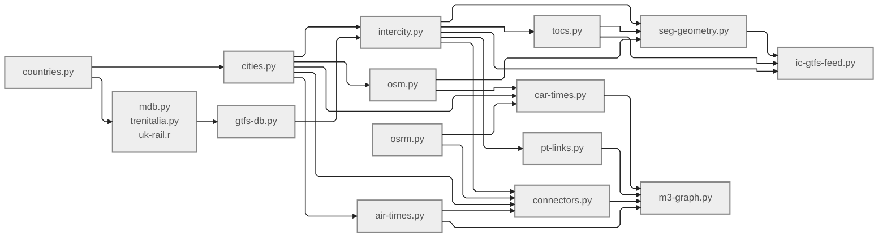

# 3MG: European intercity multimodal network

## Table of contents
- [Introduction](#introduction)
- [Network description](#network-description)
- [How to use](#how-to-use)
- [Data sources](#data-sources)
- [Parameters](#parameters)
- [Methods](#methods)
- [Limitations and next steps](#limitations-and-next-steps)
- [Licensing and attribution](#licensing-and-attribution)

## Introduction

This repository provides the pipeline used to generate a harmonised, schedule-based multimodal intercity network of Europe, referred to as **3MG**. It is the first major output of Work Package 2 (WP2) of the **3MARS** research project.

### About the project: 3MARS

The 3MARS project aims to develop theories and models for long-distance transport markets of Europe in which behaviour, network development, service-provider strategies, pricing and policy interact.

- **Title**: Behavior, Network, Market and Policy Dynamics in Multi-Modal, Multi-Layer and Multi-Class Air and Rail Transport Systems (**3MARS**)
- **Webpage**: [doi.org/10.3030/101171152](https://doi.org/10.3030/101171152)
- **Principal investigator**: Dr. Oded Cats ([o.cats@tudelft.nl](mailto:o.cats@tudelft.nl)), Delft University of Technology
- **Dates**: May 2025 – April 2030
- **Funder**: European Research Council (grant #101171152)
<!-- - **WP2 contributors**: Dr. Rajat Verma ([r.verma@tudelft.nl](mailto:r.verma@tudelft.nl)), Hanyu Cheng ([H.Cheng-7@student.tudelft.nl](mailto:H.Cheng-7@student.tudelft.nl)) -->

### About the module: WP2

Work Package 2 (**WP2**) of the 3MARS project focuses on developing a multimodal, multi-agency and multi-class traffic flow assignment model for a given intercity demand distribution matrix.
It is led by Dr. Rajat Verma ([r.verma@tudelft.nl](mailto:r.verma@tudelft.nl)) and supported by Hanyu Cheng ([h.cheng-7@student.tudelft.nl](mailto:H.Cheng-7@student.tudelft.nl)).
It has five core submodules:

1. Base 3MG generation
2. Pathset construction
3. Demand loading
4. Mode-route choice modelling
5. Network assignment (congestion-agnostic)

The current repository covers part of the first submodule: base 3MG generation.

## Network description

**3MG** refers to the "Multi-modal, multi-agency, multi-label (3M) graph" developed as part of the first major task of 3MARS WP2.
It combines Functional Urban Areas (FUAs), population, airports, intercity bus and rail services, scheduled flights, the road network and local access links into a common node-link model.
It is a directed multigraph connecting major cities (FUAs) and their transport hubs with intracity and intercity links by multiple modes and agencies/operators.

It consists of two types of nodes:

- **Cities**: These serve as the demand producers and attractors. They are located by their population-weighted centroids over their boundary.
- **Transport hubs**: These nodes serve as the supply providers for demand distribution. These consist of airports and public transport (PT) stations, i.e., bus and rail stations.

3MG has three types of links:

- **Intercity**: They connect a transport hub of a city to a hub of another city by a unique travel mode and agency/operator (directed). Four modes are considered:
  - **Car** (driving between city centroids)
  - **Bus and rail** (by different operators)
  - **Air** (by different airlines)
- **Local**: They represent the connections among the transport hubs of a city (FUA), used mainly for network connectivity (directed). They are assumed to be used by agency-agnostic local public transportation.
- **Connector**: These virtual access/egress links serve as the topological connection between the demand generators/attractors (i.e., population distribution of an FUA) and the supply nodes (i.e., the transport hubs of that FUA). They are assumed to be used by car and do not contain any service information.

3MG is a static supply graph in P-space representation, meaning all nodes that have a direct connection by a single service or route are connected by a direct link. The modal tables provide travel time, routed distance and service frequency, while the final graph currently retains travel time and frequency. These metrics provide the basis for later multi-class estimates of generalised travel cost (GTC), such as different perceived costs for travellers with different income levels or trip purposes. Fares and capacities are not yet included.
It is currently a static, service-aggregated representation: travel time and frequency summarise timetables or routing results rather than describing a complete time-dependent event graph.

The current development snapshot contains 1,370 nodes and 191,476 links; the release-blocking endpoint issue described under [Limitations](#limitations) still applies.

## How to use

### Create 3MG

1. Clone this repository to a clean local working directory.
```bash
git clone https://github.com/rvanxer/3MARS-WP2.git
cd 3MARS-WP2
```
2. Create a [Conda](https://docs.conda.io/projects/conda/en/latest/user-guide/install/index.html) environment and install the dependencies:
```bash
conda create -n 3mars -c conda-forge \
  python=3.14 pip \
  pyrosm=0.13.1 osmium-tool gdal \
  r-base r-remotes r-zip

conda activate 3mars

Rscript -e 'remotes::install_github("ITSLeeds/UK2GTFS", upgrade = "never")'

python -m pip install -r requirements.txt
```
3. Install [Docker Desktop](https://www.docker.com/products/docker-desktop/) and run it for [OSRM](https://project-osrm.org)-based shortest path routing for car travel times.
<!-- 2. If you have [Homebrew](https://brew.sh) installed, use:
```bash
brew install docker
 -->
4. Verify the dependencies setup:
```bash
python -m pip check
python -c "from pyrosm import OSM; print('Pyrosm OK')"

Rscript -e 'library(remotes); library(zip); library(UK2GTFS); cat("R packages OK\n")'

osmium --version | head -2
ogr2ogr --version
docker --version
```
5. Create an environment file (`env.yml`) in the project root and add the following to it:
```yml
# Main data directory for the project (must have read & write permissions)
DATA_DIR: absolute/path/to/your/target/data/directory
# MobilityDatabase API key (needed for GTFS catalogue and data download)
MDB_API_KEY: personal_MDB_API_key
# CartoDB API token (optional; mainly used for plotting basemap)
CARTO_TOKEN: personal_CartoDB_token
```
In most scripts, the utility import `import config as C` loads these environment variables as global constants, notably converting `DATA_DIR` of env.yml to `C.DATA`.
6. Copy manually acquired/proprietary datasets to `{C.DATA}`. This directory should have sufficient local storage for raw GTFS archives, country PBF files, OSRM working files and the multi-million-row Parquet tables.
   - manually acquired GTFS ZIPs alongside downloaded feeds in `gtfs/feeds/`.
   - UK ATOC input at `gtfs/uk-atoc.zip` if the UK feed is rebuilt;
   - operator mapping at `gtfs/agency2toc.xlsx`;
   - [Proprietary] OAG schedules to `oag-schedules.zip`;

7. Run the scripts from this directory in the following order:

| Order | Script | Objective |
|--|--|--|
| 1 | [countries.py](countries.py) | Obtain boundaries for target countries from [NUTS](https://ec.europa.eu/eurostat/web/nuts) and [ITL](https://www.ons.gov.uk/methodology/geography/ukgeographies/eurostat) (for the UK). |
| 2 | [cities.py](cities.py) | Obtain FUA boundaries and population grid from [JRC](https://commission.europa.eu/about/departments-and-executive-agencies/joint-research-centre_en) and [GISCO](https://ec.europa.eu/eurostat/web/gisco). |
| 3 | [osm.py](osm.py) | Download national OSM geodatabase extracts from [GeoFabrik](https://www.geofabrik.de), extract railway and highway networks and filter OSM PBF files for FUA boundaries. |
| 4 | [mdb.py](mdb.py) | Download GTFS feeds from [Mobility Database](https://mobilitydatabase.org) for the study countries. |
| 4 | [trenitalia.py](trenitalia.py) | Convert Trenitalia timetable data from [NeTEx](https://transmodel-cen.eu/index.php/netex) format to GTFS. |
| 4 | [uk-rail.r](uk-rail.r) | Convert UK rail timetable data from legacy ATOC format to GTFS. |
| 5 | [gtfs-db.py](gtfs-db.py) | Harmonise and clean the obtained GTFS ZIP files into a compact GTFS database. |
| 6 | [intercity.py](intercity.py) | Filter intercity network and timetable from GTFS database. |
| 7 | [tocs.py](tocs.py) | Map GTFS agencies to major public transport operators. |
| 8 | [seg-geometry.py](seg-geometry.py) | Approximate interstation segment geometry by routing along modal OSM network. |
| - | [ic-gtfs-feed.py](ic-gtfs-feed.py) | [Optional] Export the prepared intercity network to a GTFS feed. |
| 9 | [pt-links.py](pt-links.py) | Obtain public transport (PT) inter- and intracity links for 3MG. |
| 10 | [air-times.py](air-times.py) | Identify airports and air links for 3MG using the [OAG](https://www.oag.com) data. |
| 11 | [car-times.py](car-times.py) | Compute intercity car travel times using [OSRM](https://project-osrm.org) routing. |
| 12 | [connectors.py](connectors.py) | Compute population-weighted connector car travel times using OSRM routing. |
| 13 | [m3-graph.py](m3-graph.py) | Prepare the 3MG using air, car and PT links. |

A more appropriate workflow diagram is shown below:


8. Verify the final graph stored in `{C.DATA}/3m-{table}.parquet` for table ∈ {`nodes`, `edges`}.
```python
import config as C

nodes = C.load("3m-nodes")
edges = C.load("3m-edges")

assert nodes["node_id"].is_unique
assert edges["src"].isin(nodes["node_id"]).all()
assert edges["trg"].isin(nodes["node_id"]).all()
assert edges["time"].ge(0).all()
assert edges["src"].ne(edges["trg"]).all()
```

## Data sources

The network combines administrative geography, population, transport infrastructure and scheduled services. Source dates are not interchangeable: the current configuration targets 30 August 2026 for the OSM and MobilityDatabase acquisition stages, while the underlying GTFS feeds retain their own publisher-specific service periods. A rebuilt network is therefore a new data version unless the same raw archives and manual inputs are retained.

### Countries and urban areas

The study area covers 28 countries: 25 EU member states other than Cyprus and Malta, together with Norway, Switzerland and the United Kingdom. Country boundaries for all study countries except the United Kingdom are taken from the 2024 level-0 [Eurostat GISCO NUTS](https://ec.europa.eu/eurostat/web/gisco/geodata/statistical-units/territorial-units-statistics) layer. The United Kingdom boundary is formed by dissolving the 2025 ITL-1 generalised clipped boundaries from the [UK Open Geography Portal](https://geoportal.statistics.gov.uk/).

Functional Urban Area (FUA) boundaries are drawn primarily from the JRC [LUISA REF-2014 FUA dataset](https://data.jrc.ec.europa.eu/dataset/jrc-luisa-ui-boundaries-fua). The 2021 [GISCO Urban Audit](https://gisco-services.ec.europa.eu/distribution/v2/urau/) layer supplements coverage for Norway and Switzerland. Population is taken from the JRC/Eurostat 2018 one-kilometre [population grid](https://ec.europa.eu/eurostat/web/gisco/geodata/grids). Grid-cell population is spatially allocated to FUAs, then used both to retain FUAs above the population threshold and to calculate population-weighted city centres and access times.

### Highway and railway network

Road and rail infrastructure is derived from dated country extracts supplied by [Geofabrik](https://download.geofabrik.de/europe.html) from [OpenStreetMap](https://www.openstreetmap.org/copyright). The active configuration requests the 30 August 2026 snapshot for each study country. The road layer retains `motorway`, `motorway_link`, `trunk`, `trunk_link`, `primary` and `primary_link` ways. The rail layer retains `railway=rail`; light rail, metro and tram infrastructure are not included in the intercity rail-routing graph.

The retained networks provide routing substrates rather than observed vehicle trajectories. Three cross-water road connections are added as explicit modelling links: the Channel crossing, the Strait of Messina and the Gulf of Finland. A rail connection is added across the Strait of Messina. Their purpose is to prevent otherwise disconnected graph components; the associated road distances and times are manual assumptions and must not be interpreted as OSM observations.

### Public transport schedule

Public transport schedules use [GTFS Schedule](https://gtfs.org/documentation/schedule/reference/) archives. MobilityDatabase is the main catalogue and archive source, supplemented by national, operator and converted feeds where the catalogue did not provide adequate intercity coverage. The pipeline reads agencies, routes, stops, trips, stop times and service calendars; fare, transfer, shape and real-time information are not used in the present graph. Because licences are assigned by individual publishers, the presence of a feed in the local collection does not by itself grant redistribution rights.

#### MobilityDatabase processing

For every study country, the MobilityDatabase API is queried for GTFS Schedule feeds. The pipeline selects the most recent dataset downloaded on or before the configured snapshot date `MDB_SNAPSHOT_DATE`, rather than requesting the latest dataset at execution time. The feed identifier, provider, dataset download date, service-date range, hosted URL and expected SHA-256 hash are retained in the dated catalogue. Downloads are streamed to temporary files and moved into the feed collection only after hash verification. Archives whose names begin with `man-` are preserved when stale catalogue downloads are removed.

This process fixes the catalogue cut-off but does not create a single European timetable date. Each selected archive has its own production date, validity period, completeness and licence. Reproducing the snapshot therefore requires preservation of the downloaded ZIP files and the dated catalogue, not merely re-running the API request.

#### Manually acquired and converted feeds
Several feeds are obtained manually outside of MobilityDatabase.
They are listed in the table below along with download links (wherever possible) and additional notes.
Note that unlike MDB feeds, these feeds are downloaded once and not anchored to a fixed snapshot date, meaning their versions may be different on user-side data reproduction.
These zip files are renamed to `man-{feed_name}.zip` ("man" for "manual") to distinguish from the MDB feeds and stored in `{DATA}/gtfs/feeds`.
<!-- The following supplemental archives were present in the audited local snapshot. Publisher names and links come from embedded `feed_info.txt` or `agency.txt` metadata where available; they describe provenance, not verified redistribution permission. -->

| Feed name | Region/Operator | Data URL (⬇︎ indicates direct download) | Preparation note |
|---|---|---|---|
| ATC | Romania and Moldova, rail | [CFR Călători](https://www.cfrcalatori.ro/), Astra Trans Carpatic and CFM | Multi-agency GTFS archive |
| BDZ | Bulgaria, rail | https://sipbg.gov.bg/bgnap/portal/en/catalog/710c84db-9f73-46b2-9731-d0df793a6133 | GTFS API export |
| Elron | Estonia, rail | ⬇︎ https://eu-gtfs.remix.com/elron.zip | Operator GTFS archive |
| Estonia | Estonia, multimodal | ⬇︎ https://s3.transitpdf.com/files/uran/improved-gtfs-maanteeamet.zip | Aggregated national archive |
| EuroStar | International high-speed rail | https://transport.data.gouv.fr/datasets/eurostar-gtfs-plan-de-transport-et-temps-reel | Multi-agency GTFS archive |
| Finland | Finland, multimodal | ⬇︎ https://mobility.mobility-database.fintraffic.fi/en | National GTFS archive |
| Latvia | Latvia, rail | ⬇︎ https://vivi.lv/uploads/GTFS.zip | Operator GTFS archive |
| Lithuania | Lithuania, multimodal | ⬇︎ https://data.public-transport.earth/gtfs/lt | National GTFS archive |
| MAV | Hungary, rail and bus | https://www.mavcsoport.hu/en/gtfs-request | National operator archive (needs sign up) |
| Norway | Norway, multimodal | ⬇︎ https://data.public-transport.earth/gtfs/no | National aggregated GTFS archive |
| OBB | Austria, rail and bus | [ÖBB](https://www.oebb.at/en/) via Busmaps metadata | Aggregated GTFS archive |
| PKPIntercity | Poland, intercity rail | ⬇︎ https://mkuran.pl/gtfs/pkpic.zip | Operator GTFS archive |
| PolRegio | Poland, regional rail | ⬇︎ https://mkuran.pl/gtfs/polregio.zip | Operator GTFS archive |
| Poland-rail | Intended Polish rail supplement | [Mikołaj Kuranowski GTFS archive](https://mkuran.pl/gtfs/) | **Requires replacement or exclusion:** the local file contains Japanese operators and is mislabelled |
| SBB | Switzerland, multimodal | [SBB](https://www.sbb.ch/en/) | National timetable archive |
| SNCB | Belgium, rail | [NMBS/SNCB](https://www.belgiantrain.be/en) | Operator GTFS archive |
| SNCF | France, rail | [SNCF](https://www.sncf.com/en) | Operator GTFS archive |
| Slovakia | Slovakia, rail | https://data.europa.eu/data/datasets/ca4cb74c-7192-4198-b074-34acd9d295e7 | National rail GTFS archive |
| Slovenia | Slovenia, bus | https://podatki.gov.si/dataset/register-linijskih-odsekov/resource/cc6c38a8-2424-41ae-9b43-f760c09d13b7 | National bus GTFS archive |
| TrainOSE | Greece, rail | ⬇︎ https://s3.transitpdf.com/files/uran/improved-gtfs-trainose.zip | Archive has 2019 service dates and requires currency review |
| Trenitalia | Italy, rail | https://www.cciss.it/nap/mmtis/public/en/catalog/Dataset/1077621 | NeTEx converted to GTFS; station names and coordinates matched to the [Trainline station database](https://github.com/trainline-eu/stations) |
| UK_rail | Great Britain, rail | https://raildata.org.uk/dataProduct/P-04b05b6e-c14d-4a53-ba34-76ee7c48cc72/overview | ATOC timetable converted with [UK2GTFS](https://github.com/ITSLeeds/UK2GTFS) |

The operator mapping in `gtfs/agency2toc.xlsx` is a project-curated input. It translates heterogeneous GTFS agency names into the operator and domicile labels used in 3MG and, because the merge retains only mapped agencies, also determines which candidate intercity services enter the final public transport network.

### Aviation data [Proprietary]

Scheduled aviation services are supplied through a licensed [OAG schedule product](https://www.oag.com/flight-info-api). The input contains carrier, flight number, origin and destination airport, local departure and arrival time, operating weekdays, effective dates, number of stops and economy-seat capacity. The source archive is proprietary and is not distributed with this repository; an authorised OAG dataset is required to rebuild the aviation layer.

Airport codes, names and coordinates are obtained from the [IP2Location IATA/ICAO list](https://github.com/ip2location/ip2location-iata-icao), which is published under CC BY-SA 4.0. Airports are retained when they appear in the OAG schedule and fall within a study country. Each airport is associated with every FUA whose population-weighted centre lies within the configured 150 km catchment radius.

## Parameters

Study-defining parameters are stored in [params.yml](params.yml). Values in the first group affect the present base-network pipeline; the pathset parameters are retained for the subsequent WP2 stages but are not consumed when generating the current `3m-nodes` and `3m-edges` tables.

| Parameter | Current value | Unit or encoding | Role in the current project |
|---|---:|---|---|
| `OSM_SNAPSHOT_DATE` | 2026-08-30 | date | Requested date of the Geofabrik country extracts |
| `MDB_SNAPSHOT_DATE` | 2026-08-30 | date | Latest MobilityDatabase dataset admitted on or before this date |
| `MIN_FUA_POPU` | 200,000 | persons | Minimum 2018 population of a retained FUA |
| `BASE_START_DATE` | 2020-01-01 | date | Reference value used to encode GTFS `day_id` |
| `BASE_END_DATE` | 2030-01-01 | date | Upper bound used while expanding GTFS calendars |
| `SERVICE_START` | 2023-01-01 | date | First service date retained in the intercity calendar matrix |
| `SERVICE_END` | 2026-12-31 | date | Last service date retained in the intercity calendar matrix |
| `RAIL_ROUTE_TYPES` | 2; 100–103; 105–109; 111; 113–114; 117; 900–906 | GTFS route types | Route types interpreted as rail |
| `BUS_ROUTE_TYPES` | 3; 200–209; 700–716 | GTFS route types | Route types interpreted as bus |
| `STOP_CLUSTER_RADIUS` | 400 | metres | DBSCAN radius for combining intercity terminal stops into stations |
| `STATION_BUFFER_RADIUS` | 400 | metres | Radius for associating nearby stops with a station when recovering local services |
| `MAX_STN_OSM_OFFSET` | 5,000 | metres | Maximum station-to-network snapping distance for OSM routing |
| `AIRPORT_CATCH_RADIUS` | 150 | kilometres | Maximum distance between an airport and an associated FUA centre |
| `CRS_EU` | EPSG:3035 | ETRS89-LAEA Europe | Metric spatial processing, including buffers, lengths and population centres |
| `CRS_DEG` | EPSG:4326 | WGS 84 | Stored GeoParquet geometries and longitude/latitude coordinates |

Parameters reserved for pathset construction and subsequent assignment work are listed below to distinguish planned modelling choices from the present network-generation assumptions.

| Parameter | Current value | Unit | Intended downstream use |
|---|---:|---|---|
| `MIN_PATH_LENGTH` | 50 | kilometres | Minimum intercity path length |
| `MAX_ROUTE_SPEED_BUS` | 120 | km/h | Bus-path plausibility threshold |
| `MAX_ROUTE_SPEED_RAIL` | 360 | km/h | Rail-path plausibility threshold |
| `N_SHORTEST_PATHS` | 20 | paths | Maximum alternatives per OD, mode and departure period |
| `DEP_HR_BINS` | 0, 6, 9, 12, 15, 18, 21, 24 | hour boundaries | Departure-time periods |
| `MIN_TRANS_TIME` | 5 | minutes | Minimum feasible transfer time |
| `MAX_TRANS_TIME` | 120 | minutes | Maximum admitted transfer time |
| `BASE_WAIT` | 10 | minutes | Assumed waiting time at the origin |
| `TRANSFER_TIME_FACTOR` | 1.7 | multiplier | Weight applied to transfer time in generalised travel time |
| `TRANSFER_PENALTY` | 10 | minutes per transfer | Fixed transfer penalty |

## Methods

### Overview

The workflow constructs 3MG in three linked layers. First, it defines the study geography by combining country and FUA boundaries with gridded population, producing the demand-producing city nodes and their population-weighted centres. Second, it derives transport supply from schedule and infrastructure data: GTFS feeds are harmonised into a common public transport database, OAG records provide scheduled flights and OpenStreetMap supplies the road and rail networks used for routing. Third, mode-specific nodes and links are standardised and combined into a directed multigraph.

Public transport is represented in P-space. A link joins two stations when a traveller can remain on one line between them, even if the service calls at intermediate stations. Directional link time, frequency and operator are derived from the underlying timetables, while distance is accumulated along routed consecutive segments. Air links are carrier-specific schedule aggregates, road links are fastest routes between FUA centres and connectors are population-weighted road access links between cities and their hubs.

The resulting graph is deliberately static and service-aggregated. It preserves modal and operator alternatives needed for later pathset, demand-loading and assignment work, while the detailed calendar and timetable tables remain available upstream. It does not yet constitute a time-dependent, capacity-constrained assignment network.

### Study geography and city nodes

Country boundaries are first restricted to the 28-country study area. JRC and GISCO FUA polygons are transformed to ETRS89-LAEA Europe before population processing. Each 2018 one-kilometre population-grid point is spatially assigned to an FUA. Cell coordinates are weighted by cell population to locate the FUA centre, total population is summed and FUAs below 200,000 residents are removed. The retained polygons and centres are stored in WGS 84.

### Schedule harmonisation

Each local GTFS ZIP is inventoried for the seven core schedule tables. Stops with identifiers and coordinates, routes with agencies and timezones, service calendars, trips and stop times are then read into feed-local tables. Original identifiers are replaced by compact integer identifiers within each feed. Repeated stop sequences, relative time sequences and service-date sets are deduplicated, allowing the continental database to store references rather than repeat long arrays for every trip. Arrival and departure clock values are converted to seconds, while service calendars are expanded between the configured baseline dates.

### Public transport network extraction

Stops are spatially joined to retained FUAs and GTFS route types are reduced to bus or rail using the configured lists. A stop sequence is considered intercity if it serves at least two retained FUAs. Stops that form the first or last call of an intercity-qualified sequence are clustered with DBSCAN using a 400 m radius; the mean cluster location defines the station. Stops within 400 m of these stations are subsequently used to recover local services that connect retained hubs.

Candidate stations are reduced without changing the set of mode-specific FUA pairs supplied by the schedule. Stations with the smallest contribution are considered first and removed only when every affected bus or rail city pair retains another station-pair witness. Lines are then defined by agency, mode, timezone offset and ordered station sequence. Service times are converted to UTC minutes using the agency timezone offset evaluated on 15 January 2025 and service calendars are restricted to 2023–2026.

### Operator selection and routed segment geometry

Candidate intercity agencies are ranked by the additional FUA pairs they contribute. A manually curated mapping assigns the retained agency names to major operators and domiciles. Intercity lines without a mapping are excluded; local lines that connect at least two retained major stations are retained under the common `.Local` operator label.

Consecutive station pairs are routed separately on simplified bus and rail infrastructure graphs. The graphs are undirected and weighted by length. Degree-two chains are contracted for efficiency, stations are snapped to their nearest modal graph node within 5 km and shortest-path geometries are calculated within connected components. The result is an inferred infrastructure path and distance, not an observed vehicle trajectory or timetable-specific track assignment.

### Mode-specific link construction

For bus and rail, every ordered pair of stations on the same line is expanded into a P-space candidate. Travel time is the elapsed timetable time from departure at the origin station to arrival at the destination station. Values are aggregated by station pair, mode and operator using the median, with the population standard deviation retained as a variability indicator. Distance is the cumulative sum of consecutive routed segments and remains missing if any required segment is unavailable. Daily frequency is calculated from the line–journey–dateset incidence matrices and stored as the median positive frequency over dates on which the link is active.

Air services are filtered to airports within the study countries. Operating-weekday strings and effective-date ranges are expanded to flight counts. Carrier-specific airport links store the flight-count-weighted mean scheduled duration and the mean number of flights per day over the combined effective period. Intercity car links use the fastest OSRM route between every reachable pair of FUA centres, augmented by the three explicit cross-water assumptions described above.

Connector links are estimated from every populated grid cell in an FUA to each airport or public transport station within the same FUA. OSRM supplies road distance and time, after which cell results are aggregated to a population-weighted mean for each city–hub pair. The final graph duplicates these connector links in both directions and combines them with intercity road, air and public transport links. Node identifiers use the prefixes `FUA_`, `AP_` and `STN_`; edge records retain link class, mode, operator, travel time and frequency.

The complete field-level catalogue is stored in `schema.json`. It records each active Parquet table, physical data type, field meaning, units, row count for the audited snapshot and CRS metadata for spatial fields. Rebuilds should regenerate or revalidate this file because both schemas and row counts can change.

## Limitations and next steps

The pipeline joins European geography, population, intercity bus and rail, aviation, road routing and local access into an analysable supply graph. Its strongest present uses are structural network analysis, accessibility screening and preparation of modal skim inputs. The limitations below define the boundary between that usable research object and the full time-dependent assignment model envisaged in 3MARS WP2.

### Limitations

- GTFS coverage, validity periods, completeness and licences vary by publisher. The MobilityDatabase cut-off is reproducible at feed level, but it does not represent a single synchronised European operating date. The manual feeds do not yet have a complete acquisition and checksum manifest and two local files require review: `man-Poland-rail` is mislabelled and `man-TrainOSE` exposes 2019 service dates.
- Bus and rail classifications depend on a project-defined subset of GTFS route types. Agency-to-operator matching is manual and unmapped agencies are excluded from the retained intercity network. Changes to either list can materially alter coverage.
- Stations are synthetic clusters, not authoritative interchange facilities. The 400 m rule ignores barriers and walking routes. The subsequent reduction preserves the supported mode-specific FUA pairs but does not preserve every stop, station pair or service pattern and station names are inherited from heterogeneous source feeds.
- Public transport times use one agency offset evaluated in winter 2025. Daylight-saving transitions and timezone changes across the full service period are not represented. P-space links further aggregate detailed calendars and departures into median time, variability and active-day frequency.
- Aviation durations are calculated from local timetable-clock values without airport-specific timezone conversion. OAG data are proprietary and the final graph does not yet expose the available seat field as capacity.
- OSM paths are shortest routes on simplified undirected infrastructure graphs. Direction, turn restrictions, access permissions, rail gauge, electrification, operating rights, track capacity and timetable-specific paths are not modelled. Manual cross-water links are connectivity assumptions. The current download URL construction also drops the two-digit year from `OSM_SNAPSHOT_DATE`; this must be corrected before a clean rebuild. In the current snapshot, 715 of 36,162 public transport links have no routed distance.
- City–hub connectors represent population-weighted road access and are copied symmetrically. They do not model walking, local public transport, congestion or asymmetric access conditions. Per-FUA connector caches are present for 360 of 384 FUAs; a missing file may indicate either no retained hub or an unsuccessful routing run and should be resolved explicitly.
- The final edge table omits distance, geometry, fares, capacity, service dates, reliability, emissions and passenger flows. Airports and stations connect through the FUA node rather than through explicit airport–station transfer links.
- The current `3m-edges.parquet` snapshot is not release-valid: 14,754 air edges use the `AIR_` prefix while airport nodes use `AP_`, so their endpoints do not resolve. This identifier mismatch must be corrected and the graph regenerated before publication.

### Next steps

1. Correct the air-node prefix, regenerate the graph and make endpoint, uniqueness, range and schema checks mandatory release gates.
2. Create a versioned provenance manifest containing the code revision, parameter file, raw-file hashes, retrieval dates, original URLs and source-specific licences; replace or exclude the two questionable manual feeds.
3. Apply date-aware timezone conversion to public transport and aviation schedules, then retain representative service calendars or construct an event-based temporal layer.
4. Complete and classify the missing FUA connector cases, introduce explicit airport–station transfers and represent access, egress and interchange by their actual modes.
5. Carry routed distance and geometry into the final edges and add fare, capacity, reliability, emissions and demand-class attributes where defensible sources are available.
6. Quantify how feed selection, route-type mapping, operator filtering, station clustering and connectivity-preserving station reduction affect modal coverage and network indicators.
7. Use the validated temporal multilayer graph to generate pathsets, load multi-class demand and implement the congestion-agnostic mode–route choice and assignment stages planned for WP2.

## Licensing and attribution

The source code is released under the [MIT Licence](LICENSE). This licence applies only to the software and repository documentation; it does not override the rights attached to input data or derived databases.

- OpenStreetMap data are © OpenStreetMap contributors and licensed under the [Open Data Commons Open Database Licence](https://www.openstreetmap.org/copyright). Public use must provide the required attribution and identify the ODbL.
- Eurostat and GISCO material must be attributed to the stated source. NUTS and FUA boundary products carry additional conditions, including the prescribed **© EuroGeographics for the administrative boundaries** notice; users must review the [dataset-specific GISCO conditions](https://ec.europa.eu/eurostat/web/gisco/geodata/statistical-units) before redistribution or commercial use.
- The JRC LUISA FUA dataset should be cited using the citation supplied on its [dataset record](https://data.jrc.ec.europa.eu/dataset/jrc-luisa-ui-boundaries-fua). UK geography must be reused under the terms stated by the Office for National Statistics source record.
- MobilityDatabase metadata are made available under CC0, but every GTFS feed remains subject to the licence and attribution requirements of its publisher. Consult the [MobilityDatabase terms](https://mobilitydatabase.org/terms-and-conditions) and preserve feed-level licence metadata.
- The IP2Location IATA/ICAO list is licensed under [CC BY-SA 4.0](https://github.com/ip2location/ip2location-iata-icao) and requires the attribution specified by its publisher.
- The [Trainline station database](https://github.com/trainline-eu/stations), used to supplement Trenitalia station names and coordinates, is licensed under ODbL.
- OAG schedules are licensed proprietary data. Their records must not be redistributed or bundled with a public release unless the governing agreement explicitly permits it; the schema catalogue documents structure only and contains no OAG values.

Any release of the processed Parquet tables must be assessed dataset by dataset. A repository-level code licence is not sufficient evidence that a combined or derived data product may be redistributed.
