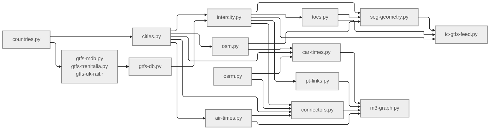

# 3MG: European intercity multimodal network

## Introduction

This repository provides the pipeline to generate a harmonised schedule-based multimodal intercity network of Europe, hereby called "**3MG**".
This is the first major outcome of Work Package 2 **(WP2)** of the "**3MARS**" research project.
The details are provided below.

### About the project: 3MARS
The 3MARS project aims to develop theories and models for long-distance transport markets of Europe in which behaviour, network development, service-provider strategies, pricing and policy interact.

- **Title**: Behavior, Network, Market and Policy Dynamics in Multi-Modal, Multi-Layer and Multi-Class Air and Rail Transport Systems (**3MARS**)
- **Webpage**: [doi.org/10.3030/101171152](https://doi.org/10.3030/101171152)
- **Principal investigator**: Dr. Oded Cats ([o.cats@tudelft.nl](mailto:o.cats@tudelft.nl)), Delft University of Technology
- **Dates**: May 2025 – April 2030
- **Funder**: European Research Council (grant #101171152)
<!-- - **WP2 contributors**: Dr. Rajat Verma ([r.verma@tudelft.nl](mailto:r.verma@tudelft.nl)), Hanyu Cheng ([H.Cheng-7@student.tudelft.nl](mailto:H.Cheng-7@student.tudelft.nl)) -->

### About the module: WP2
Work package 2 (**WP2**) of the 3MARS project that focuses on developing a multi-mode, multi-agency and multi-class traffic flow assignment model for a given intercity demand distribution matrix.
It is led by Dr. Rajat Verma ([r.verma@tudelft.nl](mailto:r.verma@tudelft.nl)) and supported by Hanyu Cheng ([H.Cheng-7@student.tudelft.nl](mailto:H.Cheng-7@student.tudelft.nl)).
It has the following core submodules:
1. Base 3MG generation
2. Pathset construction
3. Demand loading and distribution
4. Mode-route choice modelling
5. Network assignment (congestion-agnostic)

## Network description
**3MG** refers to the "Multi-modal, multi-agency, multi-label (3M) graph" developed as part of the first major task of 3MARS WP2.
It combines Functional Urban Areas (FUAs), population, airports, intercity bus and rail services, scheduled flights, the road network and local access links into a common node-link model.
It is a directed multigraph connecting major cities (via FUAs) and their transport hubs with intracity and intercity links by multiple modes and agencies/operators/service providers.
It consists of two types of nodes:
- **Cities**: These serve as the demand producers and attractors. They are located by their population-weighted centroids over their boundary.
- **Transport hubs**: These nodes serve as the supply providers for demand distribution. These consist of airports and public transport (PT) stations, i.e., bus and rail stations.

3MG has three types of links:
- **Intercity**: They connect a transport hub of a city to a hub of another city by a unique travel mode and agency/operator (directed). Four modes are considered:
  - **Car** (driving between city centroids)
  - **Bus** & **rail** (by different operators)
  - **Air** (by different airlines)
- **Local**: They represent the connections among the transport hubs of a city (FUA), used mainly for network connectivity (directed). They are assumed to be used by agency-agnostic local public transportation.
- **Connector**: These virtual access/egress links serve as the topological connection between the demand generators/attractors (i.e., population distribution of an FUA) and the supply nodes (i.e., the transport hubs of that FUA). They are assumed to be used by car and do not contain any service information.

3MG is a static supply graph in P-space representation, meaning all nodes that have a direct connection by a single service/route are connected by a direct link.
Its multiple link metrics – travel time, path distance, service frequency, travel cost [currently excluded] and capacity [currently excluded] – provide the basis for multi-class estimation of generalised travel cost (GTC), such as different perceived  GTC for travellers of different income segments or trip purposes.


<!-- The audited local snapshot contains two main deliverables: -->
<!-- 
| Table | Rows | Meaning |
|---|---:|---|
| `3m-nodes.parquet` | 3,986 | Cities, airports and public-transport stations in WGS 84 |
| `3m-links.parquet` | 195,624 | Directed car, air, bus, rail and urban-access links | -->

<!-- The graph is a **directed multigraph**. Direction matters for scheduled services and road times, while the same ordered node pair may have several links for different modes or operators. It is currently a static, service-aggregated representation: `time` and `freq` summarise timetables or routing results rather than describing a complete time-dependent event graph. -->

## Data sources

The following sources are used by the active pipeline or shown as planned inputs in the [WP2 workflow diagram](https://www.figma.com/design/q9qf1ZdNg67NRmT2d4mUEP/3MARS?node-id=864-700&t=8PiWYVmlKl2Zz9uX-1). Executable code and archived source files remain authoritative where the diagram and pipeline differ.

| Source | Contribution | Status and access |
|---|---|---|
| [Eurostat GISCO NUTS](https://ec.europa.eu/eurostat/web/gisco/geodata/statistical-units) | 2024 NUTS-0 country boundaries | Active, open European Commission data |
| [UK Open Geography Portal](https://geoportal.statistics.gov.uk/) | 2025 ITL-1 boundaries, dissolved to the UK outline | Active, open ONS geography; the code uses the ArcGIS feature service |
| [JRC LUISA FUA boundaries](https://data.jrc.ec.europa.eu/dataset/jrc-luisa-ui-boundaries-fua) | Main REF-2014 FUA polygons | Active, open JRC data |
| [GISCO Urban Audit / FUA data](https://gisco-services.ec.europa.eu/distribution/v2/urau/) | Supplementary FUA polygons for Norway and Switzerland | Active, open European Commission data |
| [JRC/Eurostat population grid](https://ec.europa.eu/eurostat/web/gisco/geodata/grids) | 2018 1 km population and population-weighted FUA centres | Active, open European Commission data |
| [Mobility Database](https://mobilitydatabase.org/) | Principal catalogue, API and archive source for GTFS Schedule feeds | Active; availability and licences vary by feed |
| [GTFS Schedule reference](https://gtfs.org/documentation/schedule/reference/) | Source-data specification | Methodological reference |
| Operator and national feeds | UK rail, Trenitalia NeTEx and other manually acquired GTFS archives | Active supplements; source terms and snapshot dates vary |
| [UK2GTFS](https://github.com/ITSLeeds/UK2GTFS) | Conversion of UK ATOC timetable data to GTFS | Active optional conversion stage in R |
| [Italian National Access Point / MMTIS](https://www.cciss.it/nap/mmtis/public/) | Trenitalia NeTEx timetable input | Active manual download/conversion stage |
| [Geofabrik Europe extracts](https://download.geofabrik.de/europe.html) and [OpenStreetMap](https://www.openstreetmap.org/copyright) | Country PBF extracts for highway, railway and urban routing | Active; OSM data are licensed under ODbL |
| [OAG Flight Info Direct](https://www.oag.com/flight-info-direct) | Scheduled flights, carriers, operating days and seats | Active licensed input; not redistributable with the code by default |
| [IP2Location IATA/ICAO database](https://github.com/ip2location/ip2location-iata-icao) | Airport codes, names and coordinates | Active open GitHub dataset |
| `gtfs/agency2toc.xlsx` | Manual mapping from GTFS agency names to operators and domiciles | Active project-curated input; no external URL |
| Google Maps observations | Directional distance and time assumptions for three cross-water car connections | Active manual input; values are embedded in `car-times.py` |
| [Eurostat air-transport data](https://ec.europa.eu/eurostat/web/transport/data/database) and fare sources | Airport-to-airport flows, fares and car costs shown in the workflow | Planned or incomplete; not included in the present final graph |

### Spatial, temporal and modelling assumptions

- Metric operations use ETRS89-LAEA Europe (`EPSG:3035`); stored geographic geometries and final node coordinates use WGS 84 (`EPSG:4326`).
- The study area covers 28 countries: 25 EU member states other than Cyprus and Malta, plus Norway, Switzerland and the United Kingdom.
- Only FUAs with an estimated 2018 population of at least 200,000 are retained.
- A GTFS stop sequence is intercity when it serves at least two retained FUAs.
- Candidate terminal stops are clustered with DBSCAN within 400 m. This is a proximity rule, not proof of a walkable or operational interchange.
- GTFS service dates are retained from 1 January 2023 to 31 December 2026. Public-transport times are converted to UTC with an agency timezone offset evaluated on 15 January 2025, so daylight-saving changes are not modelled.
- The bus-routing network retains motorway, trunk and primary roads and their link classes. The rail-routing network retains `railway=rail` only.
- Stations are snapped to a modal OSM graph within 5 km. Unsnapped or unreachable station pairs retain no routed segment distance or geometry.
- OSM graphs are undirected and distance-weighted. Road direction, turn restrictions, railway operating rights, gauge and track capacity are not represented in the inferred public-transport geometry.
- Air and public-transport links are timetable aggregates. Capacities, fares, reliability, service-day states and passenger flows are not yet fields in the final graph.

## How to use

### Workflow



### Runtime dependencies

Run the scripts from this `code/` directory. The source uses Python 3.10+ syntax, GeoParquet and Shapely 2 operations. No supported lockfile is currently included, so the following list is a reproducibility specification rather than a tested one-command environment:

```bash
python -m pip install \
  numpy pandas geopandas shapely pyarrow PyYAML requests tqdm \
  scikit-learn scipy python-igraph pyrosm lxml matplotlib ipython \
  openpyxl numba pyproj mobility-db-api
```

System dependencies are:

- [Docker](https://www.docker.com/) for `ghcr.io/project-osrm/osrm-backend:v5.27.1`;
- [Osmium Tool](https://osmcode.org/osmium-tool/) for filtering, merging and clipping OSM PBF files;
- [GDAL](https://gdal.org/) with `ogr2ogr` for OSM-to-GeoPackage conversion;
- R with `remotes`, `zip` and [UK2GTFS](https://github.com/ITSLeeds/UK2GTFS) only when rebuilding the UK
  rail feed;
- sufficient local storage for raw GTFS archives, country PBF files, OSRM working files and the multi-million-row Parquet tables.

The notebooks additionally use `contextily`, `matplotlib-scalebar`, `plotly`, `seaborn` and Jupyter/IPython. `kagglehub` is only needed for the experimental RENFE fare stage, which does not feed the current final graph.

### Configuration and required local inputs

1. Set `DATA` in `config.py` to a writable data root. The current checkout uses an absolute local path and is therefore not portable without editing.
2. Supply a Mobility Database refresh token locally through `C.MDB_API_KEY`. Do not commit credentials. The present checkout should be refactored to an environment variable or untracked secrets file before public release.
3. Review `params.yml`. Its current study-defining values include:

   | Parameter | Value | Effect |
   |---|---:|---|
   | `MIN_FUA_POPU` | 200,000 | Minimum retained FUA population |
   | `SERVICE_START`, `SERVICE_END` | 2023-01-01, 2026-12-31 | Retained GTFS service-date window |
   | `STOP_CLUSTER_RADIUS` | 400 m | DBSCAN terminal-stop clustering radius |
   | `STATION_BUFFER_RADIUS` | 400 m | Nearby stops admitted to intracity station sequences |
   | `MAX_STN_OSM_OFFSET` | 5,000 m | Maximum station-to-OSM snap distance |
   | `AIRPORT_CATCH_RADIUS` | 150 km | Airport-to-FUA-centre catchment list |
   | `MAX_ROUTE_SPEED_BUS`, `MAX_ROUTE_SPEED_RAIL` | 120, 360 km/h | Path plausibility thresholds for later path construction |
   | `MIN_TRANS_TIME`, `MAX_TRANS_TIME` | 5, 120 min | Transfer bounds for later timetable paths |

4. Place non-downloadable or manually acquired inputs where the scripts expect
   them:
   - OAG schedules at `DATA/air/oag-schedules-20220801-20251231.zip`;
   - UK ATOC input at `DATA/gtfs/uk-atoc.zip` if the UK feed is rebuilt;
   - operator mapping at `DATA/gtfs/agency2toc.xlsx`;
   - manually acquired GTFS ZIPs alongside downloaded feeds in
     `DATA/gtfs/feeds/`.

### Rebuild order

The scripts are notebook-style modules with top-level execution rather than a single orchestrated command. Run them in this dependency order:

| Stage | Module(s) | Principal outputs |
|---:|---|---|
| 1 | `countries.py` | `countries.parquet` |
| 2 | `cities.py` | `popu-grid.parquet`, `fuas.parquet` |
| 3 | `gtfs-mdb.py`, `gtfs-trenitalia.py`, `gtfs-uk-rail.r` and manual feed acquisition | `gtfs/mdb-feed-info.parquet`, `gtfs/feeds/*.zip` |
| 4 | `gtfs-db.py` | `gtfs/feed-info.parquet`, per-feed clean caches and six `gtfs/db-*` tables |
| 5 | `intercity.py` | Six `ic-*` schedule/network tables before operator filtering |
| 6 | `tocs.py` | `gtfs/imp-agencies.csv` and operator-enriched `ic-*` tables |
| 7 | `osm.py` | Country/city PBF extracts, `osm/highways.parquet`, `osm/railways.parquet` and `osm/highways.osm.pbf` |
| 8 | `seg-geometry.py` | Routed distance and geometry in `ic-segments.parquet` |
| 9 | `air-times.py`, `car-times.py`, `pt-links.py`, `connectors.py` | Modal link tables and per-FUA connector caches |
| 10 | `m3-graph.py` | `m3-nodes.parquet` and the enriched combined edge table |
| Optional | `ic-gtfs-feed.py` | `gtfs/eu-intercity.gtfs.zip` for external GTFS validation and reuse |

`osm.py` can run after stage 2 while GTFS processing continues. `air-times.py` and `car-times.py` can also run independently once their geographic, OSM and licensed inputs are available.

### Current reproducibility boundaries

The source is not yet a turnkey clean-room rebuild. Resolve or record the following before treating a run as publication-reproducible:

- The project folder is not currently a Git repository and has no dependency lockfile. Record a code revision, environment lock and checksums of every raw source for a citable release.
- Mobility Database and Geofabrik URLs request the latest available data. Archive every downloaded ZIP/PBF, retrieval date, original URL, licence and SHA-256 checksum rather than relying on a future rerun of `latest` endpoints.
- `gtfs-db.py` reuses existing per-feed clean caches unless they are explicitly overwritten. A source-feed update is not a clean rebuild unless the matching cache is regenerated.
- UK rail, operator mapping and cross-water road assumptions contain manual steps.
- OAG data are licensed and cannot be reconstructed without authorised access.
- The current connector cache has files for 381 of 384 FUAs; Granada, Patra and Reggio nell'Emilia are absent and should be investigated or explicitly excluded.

For a reproducible release, retain immutable raw inputs, the processed Parquet snapshot, a machine-readable provenance manifest, exact software versions and a validation report. Rebuilding from live feeds should be treated as producing a new version of the network rather than reproducing the old one.

### Reading and checking the final graph

```python
from pathlib import Path

import pandas as pd

data = Path("/path/to/3mars-data")
nodes = pd.read_parquet(data / "m3-nodes.parquet")
links = pd.read_parquet(data / "m3-links.parquet")

assert nodes["node_id"].is_unique
assert links["src"].isin(nodes["node_id"]).all()
assert links["trg"].isin(nodes["node_id"]).all()
assert links["time"].ge(0).all()
assert links["src"].ne(links["trg"]).all()
```

At minimum, a release check should also verify Parquet schemas, GeoParquet CRS metadata, uniqueness of table primary keys, all documented foreign keys, non-negative distances and frequencies, valid date columns and the expected node and link-kind counts.

## Schema

### Encodings and units

- `geometry` is GeoParquet geometry in WGS 84 unless stated otherwise.
- IDs are table-local integers until they are prefixed in `m3-nodes`.
- `fid` identifies a source feed; joins to GTFS-derived tables generally need both `fid` and the feed-local or condensed ID.
- `day_id` is encoded as integer `YYYYMMDD - 20200101`; it is **not** elapsed days. `ic-datesets` instead uses one Boolean column per calendar date.
- GTFS condensed times are seconds, intercity timetable values are UTC minutes and final link times are minutes.
- OSM and public-transport distances are kilometres. Per-FUA connector-cache distance and aggregated connector distance are metres.
- `list<T>` columns preserve ordered sequences unless their description says they are provenance lists or unordered membership collections.

## 3M graph

### Nodes: `m3-nodes.parquet`

Node identifiers are globally unique strings. City locations are population-weighted FUA centres, airport locations are published airport coordinates and station locations are the mean coordinates of clustered GTFS terminal stops. Station type is inferred from the bus and rail lines serving the station.

| Node kind | ID pattern | Rows | Interpretation |
|---|---|---:|---|
| City | `FUA_###` | 384 | FUA with population of at least 200,000 |
| Airport | `AP_IATA` | 297 | Airport with at least one retained scheduled air service |
| Bus station | `STN_####` | 1,258 | Cluster served only by bus lines |
| Rail station | `STN_####` | 95 | Cluster served only by rail lines |
| Multimodal station | `STN_####` | 1,952 | Cluster served by both bus and rail lines |

| Field | Logical type | Description |
|---|---|---|
| `node_id` | string | Primary key; globally unique prefixed node ID |
| `kind` | category | `City`, `Airport`, `Bus station`, `Rail station` or `Multimodal station` |
| `local_id` | string | FUA ID, IATA code or intercity station ID before prefixing |
| `name` | string | FUA, airport or cleaned first station-name candidate |
| `lon` | float32 | Longitude in WGS 84 (`EPSG:4326`) |
| `lat` | float32 | Latitude in WGS 84 (`EPSG:4326`) |

### Links: `m3-links.parquet`

The current `m3-links` snapshot contains 145,888 car-coded links (including 6,982 city-hub connectors), 14,754 air links, 19,803 bus links and 15,179 rail links. Self-links are removed. All times are stored in minutes, but their construction differs by link family:

| Link family | Endpoints | Construction and interpretation |
|---|---|---|
| Intercity car | City → city | Fastest OSRM route between FUA population centres on the retained OSM highway network; includes three manually specified cross-water connections |
| Air | Airport → airport | Carrier-specific mean scheduled duration and mean flights per day from OAG schedules |
| Bus and rail | Station → station | Operator-specific adjacent-station links; median timetable time, dispersion, median active-day frequency and median routed distance are first calculated in `pt-links` |
| Urban connector | City ↔ station or airport | Population-weighted mean OSRM access time from grid cells inside the FUA; the aggregated link is copied in both directions |

| Field | Logical type | Description |
|---|---|---|
| `src` | string | Origin `node_id` (foreign key to `m3-nodes.node_id`) |
| `trg` | string | Destination `node_id` (foreign key to `m3-nodes.node_id`) |
| `mode` | category | `Car`, `Air`, `Bus` or `Rail`; connectors are presently encoded as `Car` |
| `operator` | string, nullable | Airline carrier or mapped public-transport operator; null for car and connector links |
| `time` | float32 | Directional travel time in minutes |
| `freq` | float32, nullable | Flights per day or median public-transport journeys per active day; null for car and connector links |

The development script `m3-graph.py` currently writes the enriched form as `m3-edges.parquet`, adding `kind = intercity | intraurban | connector`. The published interface should be standardised on one filename and one schema before release. The current audited `m3-links.parquet` is referentially valid; the development `m3-edges.parquet` still uses `AIR_` rather than `AP_` for air link endpoints and therefore needs correction before it replaces `m3-links`.

### Compact data dictionary

Row counts below describe the audited local snapshot. They will change when live GTFS, OSM, manual mappings or study parameters change.

| Layer | Table and rows | Schema | Purpose and relationships |
|---|---:|---|---|
| Geography | `countries.parquet` — 28 | `icc: string`, `name: string`, `geometry` | Study-country polygons; `icc` is the key used by sources and FUAs. |
| Geography | `popu-grid.parquet` — 2,416,631 | `icc: category`, `popu: int32`, `x: int32`, `y: int32` | 2018 population-grid cells in `EPSG:3035`; used for FUA population, centres and access weighting. |
| Geography | `fuas.parquet` — 384 | `id: int16`, `name: string`, `icc: string`, `popu: int32`, `centre: point`, `geometry: polygon` | Retained FUAs. `id` becomes the city node `local_id`; `centre` is population-weighted. |
| GTFS provenance | `gtfs/mdb-feed-info.parquet` — 1,185 | `icc`, `name`, `provider`, `status`, `date`, `url: string` | Mobility Database catalogue snapshot and hosted download URL. |
| GTFS provenance | `gtfs/feed-info.parquet` — 1,389 | `id: int16`, `name: string`, `size_zip`, `size_unzip: float`, `f_agency` … `f_trips: bool` | Inventory of local source archives, assigned feed ID and presence of seven required GTFS tables. |
| GTFS clean cache | `gtfs/clean/{feed}/*.parquet` — per feed | Six feed-local forms of `stops`, `routes`, `stop_seq`, `time_seq`, `datesets`, `trips` | Reusable cleaning cache. Feed-local original IDs are retained here, then removed from combined tables where not needed. |
| Harmonised GTFS | `gtfs/db-routes.parquet` — 415,864 | `fid: int16`, `id: int32`, `name`, `agency`, `tz: string`, `mode_id: int16` | Condensed GTFS routes joined to agency name and timezone. |
| Harmonised GTFS | `gtfs/db-stops.parquet` — 6,295,179 | `fid: int16`, `id: int32`, `name: string`, `lon`, `lat: float32` | Source stops with usable identifiers and coordinates. |
| Harmonised GTFS | `gtfs/db-stop_seq.parquet` — 2,132,736 | `fid: int16`, `id: int32`, `stop_id: list<int64>` | Deduplicated ordered stop sequences referenced by `db-trips.stopseq_id`. |
| Harmonised GTFS | `gtfs/db-time_seq.parquet` — 4,648,934 | `fid: int16`, `id: int32`, `arr_time`, `wait: list<int64>` | Relative arrival-second and dwell-second sequences referenced by `db-trips.timeseq_id`. |
| Harmonised GTFS | `gtfs/db-datesets.parquet` — 477,905 | `fid: int16`, `id: int32`, `day_id: list<int64>` | Deduplicated service-date sets from `calendar` and `calendar_dates`. |
| Harmonised GTFS | `gtfs/db-trips.parquet` — 36,634,274 | `fid: int16`, `id: int64`, `route_id`, `dateset_id`, `stopseq_id`, `timeseq_id: int32`, `start`, `end: int32` | Condensed source trips. `start` and `end` are seconds from the source service-day origin. |
| Intercity PT | `ic-stations.parquet` — 3,305 | `stn: uint16`, `name: string`, `fua: int16`, `feed`, `stop: list<int64>`, `geometry: point` | Clustered intercity terminal stations. `feed` and `stop` retain source provenance. |
| Intercity PT | `ic-lines.parquet` — 68,850 | `line: int64`, `agency`, `operator: string`, `rail: bool`, `tz_gap: int32`, `stn: list<int64>`, `intercity: bool` | Unique agency-mode-timezone station sequences. `operator` is manually mapped for intercity lines and `.Local` for retained urban lines. |
| Intercity PT | `ic-journeys.parquet` — 4,648,928 | `jrn`, `line`, `dateset: int32`, `dep: int16`, `feed: int16`, `trip`, `stopseq`, `timeseq: int32` | Services on one line, dateset and departure; source references support traceability. |
| Intercity PT | `ic-datesets.parquet` — 220,948 | `dateset: int32`, `{YYYYMMDD}: bool` | Service-date matrix with 1,461 daily columns from 2023-01-01 through 2026-12-31. |
| Intercity PT | `ic-timetable.parquet` — 14,350,194 | `jrn: int32`, `stn: uint16`, `arr`, `dep: int16` | Time-sorted journey events in minutes relative to the UTC day; values may cross midnight. |
| Intercity PT | `ic-segments.parquet` — 22,660 | `seg: int64`, `src`, `trg: int32`, `mode: string`, `len_km: float`, `line: list<int64>`, `geometry` | Consecutive station pairs enriched with shortest OSM geometry. A pair can occur separately by mode. |
| Operator mapping | `gtfs/imp-agencies.csv` and `gtfs/agency2toc.xlsx` | Agency, mode, OD contribution, country, operator and domicile fields | Candidate-operator inventory and manual agency-to-operator mapping used by `tocs.py`. |
| OSM | `osm/highways.parquet` — 3,045,806 | `geometry: line`, `len_km: float32` | Retained major-road geometries after dissolve/explode and manual cross-water connectors. |
| OSM | `osm/railways.parquet` — 1,035,212 | `icc: string`, `len_km: float`, `geometry: line` | `railway=rail` geometries, simplified by 0.0001 degrees, plus the Messina train-ferry connector. |
| OSM routing | `osm/country/*.osm.pbf`, `osm/citygroup/*.osm.pbf`, `osm/city/*.osm.pbf` | OSM PBF | Archived country extracts and complete-way clips used by modal and connector routing. |
| Air | `air-timetable.parquet` — 9,174,523 | `carrier`, `src`, `trg: category`, `flight: int16`, `dep`, `arr: int16`, `nstops: int8`, `op_days`, `start_date`, `end_date: category`, `seats: int16` | Condensed OAG schedule rows; `dep` and `arr` are timetable-clock minutes. |
| Air | `airports.parquet` — 297 | `iata`, `icao`, `name`, `icc: string`, `geometry: point`, `fua: list<int64>` | Retained airport locations and FUAs whose population centres fall within 150 km. |
| Air | `air-links.parquet` — 14,779 | `src`, `trg`, `carrier: category`, `time`, `freq: float`, `nflights`, `ndays: int64` | Directed carrier-specific airport links; mean duration and flights per day over each aggregate span. |
| Car | `car-links.parquet` — 138,906 | `src_fua`, `trg_fua: int16`, `time`, `dist: float32` | Directed FUA-centre road matrix; minutes and kilometres, including manual cross-water paths. |
| Public transport | `pt-links.parquet` — 34,982 | `src`, `trg: int64`, `intercity`, `rail: bool`, `operator: string`, `n_lines: uint16`, `dist`, `time`, `sd_time`, `freq: float32` | Operator-specific adjacent-station links. Distance is kilometres; times are minutes and frequency is the median over active days. |
| Access | `connectors/{fua}.parquet` — 381 files | `fua: int64`, `cell: int32`, `popu: int32`, `hub`, `kind: string`, `dist`, `time: int32` | Per-FUA OSRM cache from population cells to contained airports and stations; metres and seconds. |
| Access | `connectors.parquet` — 5,260 | `fua: int64`, `hub`, `kind`, `name: string`, `time`, `dist: float32` | Population-weighted hub access; time is minutes and distance remains metres. |
| Final graph | `m3-nodes.parquet` — 3,986 | `node_id`, `kind`, `local_id`, `name: string`, `lon`, `lat: float32` | Common city-airport-station node table described above. |
| Final graph | `m3-links.parquet` — 195,624 | `src`, `trg: string`, `mode: category`, `operator: string?`, `time`, `freq: float32?` | Established directed combined-link table; every endpoint currently resolves to `m3-nodes`. |
| Development graph | `m3-edges.parquet` — 195,624 | `src`, `trg: string`, `kind`, `mode: category`, `operator: string?`, `time`, `freq: float32?` | Enriched successor with link kind; filename and air endpoint prefix still require correction. |

## Conclusion

The pipeline already joins European geography, population, intercity bus and rail, aviation, road routing and local access into one analysable graph. Its strongest present use is structural network analysis and preparation of modal skim inputs. It is not yet the temporal, capacity-constrained, multi-class assignment model envisaged in 3MARS Objective 2.

### Main limitations

- Source coverage, licence, completeness and date vary between GTFS feeds. The network is a latest-available compilation rather than one synchronised European operating day.
- Station construction uses only terminal stops of intercity-qualified sequences and a 400 m Euclidean cluster. Names remain partly unrefined and the 3,305 stations are too numerous for some assignment experiments.
- There is no direct airport ↔ station link. Airports and stations connect to a city node independently, so air-rail interchange is not yet represented as a specific walk, public-transport or road transfer.
- The final `m3-links` table omits distance, geometry, capacity, fare, service dates, variability, reliability and emissions. Although modal tables retain some distances, `pt-links.dist` is missing for 3,877 links where OSM routing did not yield a usable segment.
- Public-transport timezone conversion uses one winter offset. Air durations are derived from timetable-clock values and require explicit timezone validation before assignment use.
- OSM route geometries are inferred on simplified, undirected modal networks. Manual cross-water connections are modelling assumptions, not observed infrastructure or service trajectories.
- Current path, filename, airport-prefix and connector-cache issues listed in the reproducibility section must be resolved before a public data release.

### Next steps

1. Reduce the station set using retained FUA-OD connectivity rather than only local degree or raw service exposure, then quantify the loss of reachable city pairs by mode.
2. Derive explicit **L-space** (consecutive-stop links) and **P-space** (stations sharing a service) representations alongside the current modal graph, with documented transfer and temporal semantics.
3. Add distances and geometries to the final link table, direct airport-station transfer links and explicit access, egress and interchange modes.
4. Preserve service calendars or build an event-based temporal layer, then add capacity, fare, reliability and demand-class fields required by WP2.
5. Standardise `ic-*` and `m3-*` output paths and names, fix air node prefixes and make referential, unit and schema validation part of every build.
6. Replace absolute paths and embedded credentials with portable configuration, pin dependencies and raw-source snapshots and publish a provenance manifest with checksums and licences.
7. Use the resulting temporal multilayer network to formulate paths, load multi-class demand and implement the stochastic, capacity- and price-aware assignment envisaged by Objective 2.

### Licensing and attribution

The source code and each upstream dataset may have different reuse terms. In particular, OSM-derived data require ODbL attribution, GTFS licences vary by publisher and OAG schedules are licensed. A public release must provide source-specific attribution and licence metadata; a code licence alone does not confer permission to redistribute all input or derived data.
