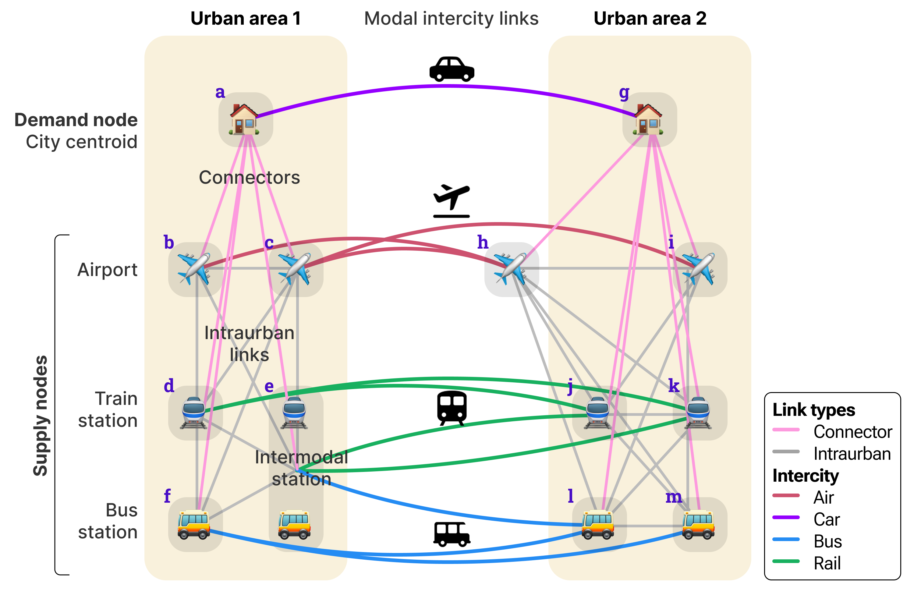
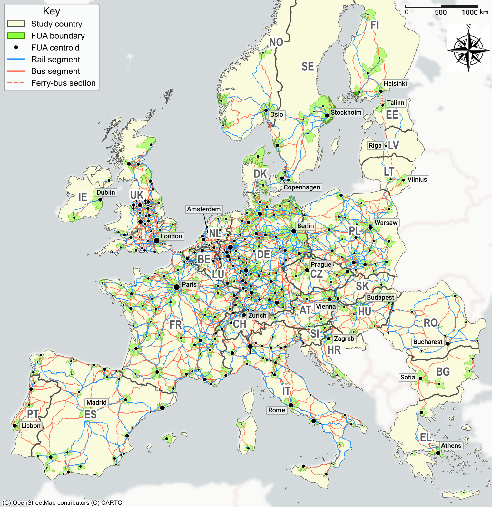

# 3MG: European intercity multimodal network

## Table of contents
- [Introduction](#introduction)
- [Network description](#network-description)
- [How to use](#how-to-use)
- [Data sources](#data-sources)
- [Parameters](#parameters)
- [Methods](#methods)
- [Limitations and next steps](#limitations-and-next-steps)
- [Licensing and attribution](#licensing-and-attribution)

## Introduction

This repository provides the pipeline used to generate a harmonised, schedule-based multimodal intercity network of Europe, referred to as **3MG**. It is the first major output of Work Package 2 (WP2) of the **3MARS** research project.

### About the project: 3MARS

The 3MARS project aims to develop theories and models for long-distance transport markets of Europe in which behaviour, network development, service-provider strategies, pricing and policy interact.

- **Title**: Behavior, Network, Market and Policy Dynamics in Multi-Modal, Multi-Layer and Multi-Class Air and Rail Transport Systems (**3MARS**)
- **Webpage**: [doi.org/10.3030/101171152](https://doi.org/10.3030/101171152)
- **Principal investigator**: Dr. Oded Cats ([o.cats@tudelft.nl](mailto:o.cats@tudelft.nl)), Delft University of Technology
- **Dates**: May 2025 – April 2030
- **Funder**: European Research Council (grant #101171152)
<!-- - **WP2 contributors**: Dr. Rajat Verma ([r.verma@tudelft.nl](mailto:r.verma@tudelft.nl)), Hanyu Cheng ([H.Cheng-7@student.tudelft.nl](mailto:H.Cheng-7@student.tudelft.nl)) -->

### About the module: WP2

Work Package 2 (**WP2**) of the 3MARS project focuses on developing a multimodal, multi-agency and multi-class traffic flow assignment model for a given intercity demand distribution matrix.
It is led by Dr. Rajat Verma ([r.verma@tudelft.nl](mailto:r.verma@tudelft.nl)) and supported by Hanyu Cheng ([h.cheng-7@student.tudelft.nl](mailto:H.Cheng-7@student.tudelft.nl)).
It has five core submodules:

1. Base 3MG generation
2. Pathset construction
3. Demand loading
4. Mode-route choice modelling
5. Network assignment (congestion-agnostic)

The current repository covers part of the first submodule: base 3MG generation.

## Network description

**3MG** refers to the "Multi-modal, multi-agency, multi-label (3M) graph" developed as part of the first major task of 3MARS WP2.
It combines [Functional Urban Areas (FUAs)](https://ec.europa.eu/eurostat/statistics-explained/index.php?title=Territorial_typologies_manual_-_cities,_commuting_zones_and_functional_urban_areas), population, airports, intercity bus and rail timetables in the [General Transit Feed Specification (GTFS)](https://gtfs.org/) format, flight schedules (from proprietary [OAG database](https://www.oag.com/)) and the road network and local access links from [OpenStreetMap (OSM)](https://www.openstreetmap.org) into a common node-link model.
It is a directed multigraph connecting major cities (FUAs) and their transport hubs with intracity and intercity links by multiple modes and agencies/operators.

It is illustrated in the figure below:



3MG consists of two types of nodes:

- **Cities**: These serve as the demand producers and attractors. They are located by their population-weighted centroids over their boundary.
- **Transport hubs**: These nodes serve as the supply providers for demand distribution. These consist of airports and public transport (PT) stations, i.e., bus and train stations, some of which have both bus and train connections ("intermodal stations").

It has three types of links:

- **Intercity**: They connect a transport hub of a city to a hub of another city by a unique travel mode and agency/operator (directed). Four modes are considered:
  - **Car** (driving between city centroids)
  - **Bus and rail** (by different operators)
  - **Air** (by different airlines)
- **Intraurban**: They represent the connections among the transport hubs of a city (FUA), used mainly for network connectivity (directed). They are assumed to be used by agency-agnostic local public transportation.
- **Connector**: These virtual access/egress links serve as the topological connection between the demand generators/attractors (i.e., population distribution of an FUA) and the supply nodes (i.e., the transport hubs of that FUA). They are assumed to be used by car and do not contain any service information. Note that an airport can be linked to multiple FUAs and may lie outside the FUA boundary.

3MG is a static supply graph in P-space representation, meaning all nodes that have a direct connection by a single service or route are connected by a direct link. The modal tables provide travel time, routed distance and service frequency, while the final graph currently retains travel time and frequency. These metrics provide the basis for later multi-class estimates of generalised travel cost (GTC), such as different perceived costs for travellers with different income levels or trip purposes. Fares and capacities are not yet included.

The current development snapshot contains 1,371 nodes and 190,921 links; its validation results and remaining qualifications are described under [Limitations](#limitations).

The following map shows the included countries, FUAs and intercity bus and rail segments:



## How to use

### Use current graph
The provided 3MG snapshot network is stored in two tables: [nodes.csv](nodes.csv) and [links.csv](links.csv).

Load, inspect and validate the current network by running `python inspect-graph.py`. The graph loads well if the script passes all assertion checks and displays summary statistics.

### Build 3MG from scratch
The 3MG can be built from scratch using open-source/publicly available geometry and public transport schedule data, though proprietary flight schedules data (purchased from OAG as part of the 3MARS project) must be used to prepare the aviation layer. The code workflow is shown below. Use the following steps to reproduce the graph.


**Step 1**: Clone this repository to a clean local working directory.
```bash
git clone https://github.com/rvanxer/3MARS-WP2.git
cd 3MARS-WP2
```
**Step 2**: Create a [Conda](https://docs.conda.io/projects/conda/en/latest/user-guide/install/index.html) environment and install the dependencies:
```bash
conda create -n 3mg -c conda-forge --strict-channel-priority \
  python=3.14 pip \
  pyrosm=0.13.1 osmium-tool gdal \
  r-base=4.5 r-remotes r-zip r-sf

conda activate 3mg
python -m pip install -r requirements.txt

# Verify the dependencies
python -m pip check
python -c "from pyrosm import OSM; print('Pyrosm OK')"
osmium --version | head -2
ogr2ogr --version
```

**Step 3**: Specify two key user-specific inputs in an environment file: (i) the path of the target data directory for processed outputs with sufficient storage (~35-40 GB) and read/write permissions (defaults to `./data`) and (ii) your [(MDB) API refresh token](https://mobilitydatabase.org/account/api-access) needed to request data from the MobilityDatabase:
```bash
DATA="path/to/your/target/data/directory"
MDB_API_KEY="your_personal_MDB_API_key"
mkdir -p $DATA
chmod -R u+rw $DATA
echo "DATA_DIR: $DATA
MDB_API_KEY: $MDB_API_KEY" > env.yml
```

**Step 4**: Download and prepare geometry data: country and FUA boundaries, population grid and highway/railway networks (both overall and city-wise):
```bash
python countries.py # download country boundaries based on NUTS & ITL regions
python cities.py # download FUA boundaries and filter based on population grid
python osm.py # download national OSM extracts and prepare rail/road networks
```

**Step 5**: Compute standard intercity car travel times and distances using the [Open-Source Routing Machine (OSRM)](https://project-osrm.org) which requires [Docker](https://www.docker.com/products/docker-desktop) to be installed and running. Run the following:
```bash
docker --version # check if Docker is properly installed
python car-times.py # compute intercity car travel times
```

**Step 6**: Prepare the aviation layer of 3MG using the following script. In the current version, it is obtained as a single timetable file stored in `{DATA}/oag-schedules.zip`.
> **Note**: Skip this step if you do not have access to the proprietary OAG [flight schedules dataset](#aviation-data-proprietary).
```bash
python air-times.py # prepare airports and inter-airport links
```

**Step 7**: For the bus and rail timetable, download GTFS data feeds from the [MobilityDatabase](https://mobilitydatabase.org) (MDB) by running:
```bash
python gtfs-mdb.py # download GTFS feeds from the MDB
```
This first generates a catalogue of available datasets closest in date to a fixed snapshot date (currently 30 Aug 2026) and then downloads them in `{DATA}/gtfs/feeds` identified by their MDB feed ID. This may take about 40-50 minutes depending on the network speed.

**Step 8**: Some GTFS feeds external to the MobilityDatabase need to be downloaded and/or processed differently by running:
   ```bash
   python gtfs-external.py # download the other GTFS feeds
   ```
This script does the following and stores the feeds in the format `{C.DATA}/gtfs/feeds/ext-{feed_name}.zip`:
- Downloads 19 feeds with a direct download link listed in [urls.yml](urls.yml), including six national GTFS archives (🇩🇰 🇱🇹 🇱🇺 🇳🇴 🇸🇪🇨🇭). Note that some of these may point to fixed data snapshot/versions while others may change over time.
- Resolves and downloads the current 🇧🇬 Bulgarian rail feed from the [BGNAP data catalogue](https://sipbg.gov.bg/bgnap/portal/api/catalog).
- Downloads the official 🇷🇴 Romanian rail feed in XML format and runs a pinned converter revision. Note that this requires the [Ruby](https://www.ruby-lang.org/en/) gem [`nokogiri`](https://nokogiri.org/index.html) to parse the XML and convert to GTFS.
- Runs [trenitalia.py](trenitalia.py) which downloads the 🇮🇹 Trenitalia rail feed in [NeTEx](https://transmodel-cen.eu/index.php/netex) format from the [Italian NAP](https://www.cciss.it/nap/mmtis/public/en/catalog/Dataset/1077621) and converts it to GTFS format. Additionally, since the stations in this feed lack coordinates, the script obtains them by mapping with the [Trainline station list](https://github.com/trainline-eu/stations).

**Step 9**: Two major GTFS feeds must be obtained by requesting manually on the providers' websites.
    
- ☑︎ Request the 🇭🇺 Hungarian state railways (MÁV) GTFS feed on https://www.mavcsoport.hu/en/gtfs-request. Move the downloaded file to `{C.DATA}/gtfs/feeds/ext-MAV.zip`.

- ☑︎ Request the 🇬🇧 UK rail feed of the target month from the [Rail Data Marketplace](https://raildata.org.uk/dataProduct/P-04b05b6e-c14d-4a53-ba34-76ee7c48cc72/overview) using a free account sign up. Move the downloaded file to `{C.DATA}/gtfs/uk-atoc.zip`. Then convert it from its legacy [ATOC](https://citygeographics.org/r5r-workshop/uk-transit-data-transxchange-and-atoc) format to GTFS format using the R package [UK2GTFS](https://itsleeds.github.io/UK2GTFS). On macOS, Ubuntu or Debian (**not tested on Windows**), run the following launcher which handles the dependencies and conversion in [uk-rail.r](uk-rail.r):
```bash
bash uk-rail.sh # convert the UK rail feed from ATOC to GTFS format
```

**Step 10**: Compute the intercity bus/rail service/timetable data using the MDB and manually downloaded GTFS feeds. The following creates multiple tables of the format `{DATA}/ic-*.parquet` along with a list of major intercity PT agencies in `{DATA}/gtfs/ic-agencies.csv`.
```bash
python gtfs-db.py # clean the GTFS feeds and organise in a database
python intercity.py # filter intercity services from the GTFS database
```

**Step 11**: Filter the important public transport operating companies (TOCs) by manually mapping GTFS agencies to a list of preset TOCs ("operators"). This step is optional but recommended to limit the number of operators and thus links in the 3MG. To do this, manually assign a suitable TOC to each agency in `{DATA}/gtfs/ic-agencies.csv` which by default is the same as the agency name. Save this manual mapping to an isolated file `{DATA}/gtfs/agency2toc.csv` to prevent accidental overwrites. For reference, the mapping used in the current snapshot of 3MG is in [agency2toc.csv](agency2toc.csv), though it is not guaranteed to be completely accurate and your version can be different based on your domain knowledge. Once the mapping is prepared, run the following to update the intercity network:
```bash
python tocs.py # update intercity network for only major TOCs
```

**Step 12**: Estimate interstation segment geometry of bus and rail routes by finding the shortest paths between consecutive stations along the highway and railway networks respectively obtained from OSM extracts in step 4 and using the OSRM routing backend. To do this, run:
```bash
python seg-geometry.py # approximate modal interstation segment geometry
```

**Step 13**: Prepare bus/rail network links and connector links, with median travel times and trip count-weighted frequencies by mode and operator:
```bash
python pt-links.py # prepare public transport interstation links
```

**Step 14**: Generate virtual connector links between city centroids (demand centres) and all transport hubs (airports and stations) by identifying shortest car path travel times between all population grid cells of a city and all transport hubs and then computing a population-weighted average travel time value for each connector:
```bash
python connectors.py # compute connector link travel times
```

**Step 15**: Create the 3MG network files by combining air, PT and car intercity links with PT intrahub and connector links in a single graph stored in two files: [nodes.csv](nodes.csv) and [links.csv](links.csv) by running:
```bash
python 3m-graph.py # generate the 3MG network
```

**Step 16**: Validate the proper loading and properties of the generated 3MG network using:
```bash
python inspect-graph.py # validate the 3MG network
```

<!-- 16. Run the scripts from this directory in the following order:

| Order | Script | Objective |
|--|--|--|
| 1 | [countries.py](countries.py) | Obtain boundaries for target countries from [NUTS](https://ec.europa.eu/eurostat/web/nuts) and [ITL](https://www.ons.gov.uk/methodology/geography/ukgeographies/eurostat) (for the UK). |
| 2 | [cities.py](cities.py) | Obtain FUA boundaries and population grid from [JRC](https://commission.europa.eu/about/departments-and-executive-agencies/joint-research-centre_en) and [GISCO](https://ec.europa.eu/eurostat/web/gisco). |
| 3 | [osm.py](osm.py) | Download national OSM geodatabase extracts from [GeoFabrik](https://www.geofabrik.de), extract railway and highway networks and filter OSM PBF files for FUA boundaries. |
| 4 | [38:10] [mdb.py](mdb.py) | Download GTFS feeds from [Mobility Database](https://mobilitydatabase.org) for the study countries. |
| 4 | [0:32] [trenitalia.py](trenitalia.py) | Convert Trenitalia timetable data from [NeTEx](https://transmodel-cen.eu/index.php/netex) format to GTFS. |
| 4 | [3:18] [uk-rail.sh](uk-rail.sh) | Prepare the R environment and convert the UK rail timetable from legacy ATOC format to GTFS. |
| 5 | [35:21] [gtfs-db.py](gtfs-db.py) | Harmonise and clean the obtained GTFS ZIP files into a compact GTFS database. |
| 6 | [intercity.py](intercity.py) | Filter intercity network and timetable from GTFS database. |
| 7 | [tocs.py](tocs.py) | Map GTFS agencies to major public transport operators. |
| 8 | [seg-geometry.py](seg-geometry.py) | Approximate interstation segment geometry by routing along modal OSM network. |
| - | [ic-gtfs-feed.py](ic-gtfs-feed.py) | [Optional] Export the prepared intercity network to a GTFS feed. |
| 9 | [pt-links.py](pt-links.py) | Obtain public transport (PT) inter- and intracity links for 3MG. |
| 10 | [air-times.py](air-times.py) | Identify airports and air links for 3MG using the [OAG](https://www.oag.com) data. |
| 11 | [car-times.py](car-times.py) | Compute intercity car travel times using [OSRM](https://project-osrm.org) routing. |
| 12 | [connectors.py](connectors.py) | Compute population-weighted connector car travel times using OSRM routing. |
| 13 | [3m-graph.py](3m-graph.py) | Prepare the 3MG using air, car and PT links. | -->

<!-- 1. Verify the final graph stored in `{C.DATA}/3m-{table}.parquet` for table ∈ {`nodes`, `edges`}.
```python
import config as C

# C.load(table) is equivalent to `pandas.read_parquet(f"{C.DATA}/{table}.parquet")`
nodes = C.load("3m-nodes")
edges = C.load("3m-edges")

assert nodes["node_id"].is_unique
assert edges["src"].isin(nodes["node_id"]).all()
assert edges["trg"].isin(nodes["node_id"]).all()
assert edges["time"].ge(0).all()
assert edges["src"].ne(edges["trg"]).all()
``` -->

## Data sources

3MG combines administrative geography and population with road and rail infrastructure, public transport timetables, flight schedules and airport metadata. These inputs are maintained by different publishers and do not share a common reference date. The current configuration uses 30 August 2026 as the acquisition cut-off for OpenStreetMap and MobilityDatabase data, while each GTFS and OAG source retains its own validity period. Consequently, every rebuild constitutes a new data version unless the raw source files, curated inputs and parameter values are preserved.

### Countries and urban areas

The study area comprises 28 countries: 25 EU member states, excluding Cyprus and Malta, plus Norway, Switzerland and the United Kingdom. Country boundaries are taken from the 2024 level-0 [Eurostat GISCO NUTS](https://ec.europa.eu/eurostat/web/gisco/geodata/statistical-units/territorial-units-statistics) layer, except for the United Kingdom, whose boundary is obtained by dissolving the 2025 ITL-1 generalised clipped boundaries from the [UK Open Geography Portal](https://geoportal.statistics.gov.uk/).

Functional Urban Area (FUA) boundaries are drawn primarily from the JRC [LUISA REF-2014 FUA dataset](https://data.jrc.ec.europa.eu/dataset/jrc-luisa-ui-boundaries-fua). The 2021 [GISCO Urban Audit](https://gisco-services.ec.europa.eu/distribution/v2/urau/) layer supplements coverage for Norway and Switzerland. Population comes from the 2018 one-kilometre [JRC/Eurostat population grid](https://ec.europa.eu/eurostat/web/gisco/geodata/grids). The grid supports FUA selection, population-weighted city-centre estimation and city-to-hub access-time calculations.

### Highway and railway network

Road and rail infrastructure is derived from dated country extracts supplied by [Geofabrik](https://download.geofabrik.de/europe.html) from [OpenStreetMap](https://www.openstreetmap.org/copyright). The active configuration requests the 30 August 2026 extract for each study country. The road-routing layer retains `motorway`, `motorway_link`, `trunk`, `trunk_link`, `primary` and `primary_link` ways. The rail-routing layer retains `railway=rail`; light rail, metro and tram infrastructure are excluded. These layers are routing substrates rather than observations of the paths followed by individual services.

### Public transport schedule

Public transport schedules are assembled from [GTFS Schedule](https://gtfs.org/documentation/schedule/reference/) archives. [MobilityDatabase](https://mobilitydatabase.org/) is the principal catalogue and archive source, supplemented by national, operator-published and converted feeds where it does not provide adequate intercity coverage. The pipeline uses agency, route, stop, trip, stop-time and service-calendar information. It does not use fares, transfers, shapes or real-time updates. Data licences remain those of the individual feed publishers.

#### MobilityDatabase processing

For each study country, the MobilityDatabase API is queried for GTFS Schedule feeds. The pipeline selects the most recent archived dataset downloaded on or before `MDB_SNAPSHOT_DATE`, rather than whichever version is latest when the code is run. A dated catalogue records the feed identifier, provider, download date, service-date range, hosted URL and expected SHA-256 hash. Each archive is downloaded to a temporary file, checked against the catalogue hash and moved into the feed collection only after verification.
<!-- Files prefixed with `ext-` are preserved when obsolete catalogue downloads are removed. -->

This procedure fixes the catalogue cut-off, not a single European operating day. Reproducing a network version therefore requires the selected ZIP archives and dated catalogue as well as the code and parameters.

#### Manually acquired and converted feeds
Some feeds are acquired outside MobilityDatabase because they require direct download, registration, format conversion or assembly from several sources. These are listed in [urls.yml](urls.yml) under the tags `gtfs-feeds` and `gtfs-edge-cases` and processed in [gtfs-external.py](gtfs-external.py). There are two special cases of 🇭🇺 MÁV and 🇬🇧 UK rail requiring manual download (and in the case of UK, further processing in [uk-rail.sh](uk-rail.sh)).

The resulting feeds are stored in `{DATA}/gtfs/feeds` as `ext-{feed_name}.zip`. Unless users preserve the acquired files themselves, later downloads may not reproduce the versions used for the published network.

<!-- The following supplemental archives were present in the audited local snapshot. Publisher names and links come from embedded `feed_info.txt` or `agency.txt` metadata where available; they describe provenance, not verified redistribution permission. -->

<!-- | Feed name | Region/operator with data URL <br>(⬇︎: direct download)</br> | Preparation note |
|---|---|---|
| ATC | [Romanian rail timetable data](https://data.gov.ro/organization/sc-informatica-feroviara-sa) | Official operator XML datasets, including CFR Călători, Astra Trans Carpatic and CFM; convert to GTFS with the [Romanian Railways GTFS exporter](https://github.com/vasile/data.gov.ro-gtfs-exporter) |
| BDZ | [Bulgarian state railways](https://sipbg.gov.bg/bgnap/portal/en/catalog/710c84db-9f73-46b2-9731-d0df793a6133) | GTFS API export |
| MAV | [Hungary bus-rail: MÁV](https://www.mavcsoport.hu/en/gtfs-request) | National operator archive (needs sign up) |
| OBB | [Austria ÖBB bus-rail](https://mobilitaetsdaten.gv.at/en/daten/gtfs-fahrplan) | Aggregated GTFS archive |
| UK Rail | [British rail](https://raildata.org.uk/dataProduct/P-04b05b6e-c14d-4a53-ba34-76ee7c48cc72/overview) | ATOC timetable converted with [UK2GTFS](https://github.com/ITSLeeds/UK2GTFS) | -->
<!-- | ******** | ******** | ******** |
| Elron | ⬇︎ [Estonian rail: Elron](https://eu-gtfs.remix.com/elron.zip) | Operator GTFS archive |
| Estonia | [Estonian public transport](https://peatus.ee/content/Veebilehest%20ja%20%C3%BChistranspordi%20avaandmetest) | The former national archive has been replaced by separate regional and operator feeds; combine the required bus feeds with the Elron feed listed above |
| EuroStar | [EuroStar high-speed rail](https://transport.data.gouv.fr/datasets/eurostar-gtfs-plan-de-transport-et-temps-reel) | Multi-agency GTFS archive |
| Finland | ⬇︎ [Finland full feed](https://mobility.mobility-database.fintraffic.fi/en) | From [European transport feeds](https://eu.data.public-transport.earth) |
| Latvia | ⬇︎ [Latvia rail (Vivi)](https://vivi.lv/uploads/GTFS.zip) | Operator GTFS archive |
| Lithuania | ⬇︎ [Lithuania full feed](https://data.public-transport.earth/gtfs/lt) | From [European transport feeds](https://eu.data.public-transport.earth) |
| Norway | ⬇︎ [Norway full feed](https://data.public-transport.earth/gtfs/no) | From [European transport feeds](https://eu.data.public-transport.earth) |
| PKPIntercity | ⬇︎ [Poland intercity rail](https://mkuran.pl/gtfs/pkpic.zip) | Operator GTFS archive |
| Poland-rail | ⬇︎ [Poland rail](https://mkuran.pl/gtfs/polish_trains.zip) | Operator GTFS archive |
| SBB | ⬇︎ [Swiss rail: SBB](https://data.opentransportdata.swiss/dataset/timetable-2026-gtfs2020/resource_permalink/gtfs_fp2026_20260829.zip) | National timetable archive |
| Slovakia | [Slovakia rail](https://data.slovensko.sk/datasety/ebeeedf1-aca2-451a-bdc0-35d536714888) | Official national rail GTFS catalogue record published by ŽSR |
| Slovenia | ⬇︎ [Slovenia bus](https://podatki.gov.si/dataset/a87483b0-a055-488c-a854-1c4a8d079a35/resource/cc6c38a8-2424-41ae-9b43-f760c09d13b7/download/20170405gtfs.zip) | National bus GTFS archive |
| SNCB | ⬇︎ [Belgian rail: NMBS/SNCB](https://opendata-discovery-gtfs-static.api.production.belgianmobility.io/api/gtfs/feed/nmbssncb/static) | Official static GTFS from the [Belgian Mobility open-data portal](https://data.belgianmobility.io/en/knowledge-base.html) |
| SNCF | ⬇︎ [French rail: SNCF](https://eu.ftp.opendatasoft.com/sncf/gtfs/transilien-gtfs.zip) | Operator GTFS archive |
| Trenitalia | [Italian rail: Trenitalia](https://www.cciss.it/nap/mmtis/public/en/catalog/Dataset/1077621) | NeTEx converted to GTFS; station names and coordinates matched to the [Trainline station database](https://github.com/trainline-eu/stations) |
| TrainOSE | ⬇︎ [Greek rail: Hellenic Train](https://jbb.ghsq.de/gtfs/gr-hellenic-train.gtfs.zip) | Current community conversion of official timetable data; not an operator-published GTFS, so preserve and validate the acquired archive | -->

#### Major operators
The repository also provides [agency2toc.csv](agency2toc.csv), a project-curated mapping from heterogeneous GTFS agency names to major  transport operating company (TOC) labels used in 3MG. A working copy is placed at `{DATA}/gtfs/agency2toc.csv` during a rebuild. Because only mapped intercity agencies are retained, this file is both a harmonisation table and an explicit model-selection input.

### Aviation data [Proprietary]

Scheduled aviation services are supplied through a licensed [OAG schedule product](https://www.oag.com/flight-info-api). The input records the carrier and flight number, origin and destination airports, local departure and arrival times, operating weekdays, effective dates, number of stops and economy-seat capacity. The source archive is proprietary and is not distributed with this repository; an authorised OAG dataset is required to rebuild the aviation layer.

Airport codes, names and coordinates come from the [IP2Location IATA/ICAO list](https://github.com/ip2location/ip2location-iata-icao), published under CC BY-SA 4.0. An airport is retained if it appears in the OAG schedule, lies in a study country and is within 150 km of at least one population-weighted FUA centre. The upstream airport table records every FUA satisfying this catchment rule.

## Parameters

Study-defining parameters are stored in [params.yml](params.yml). Values in the first group affect the present base-network pipeline; the pathset parameters are retained for the subsequent WP2 stages but are not consumed when generating the current `3m-nodes` and `3m-edges` tables.

| Parameter | Value | Description |
|---|---:|---|
| `OSM_SNAPSHOT_DATE` | 1/9/2026 | Requested date of the Geofabrik country extracts |
| `MDB_SNAPSHOT_DATE` | 30/8/2026 | Latest MobilityDatabase dataset admitted on or before this
| `MIN_FUA_POPU` | 200,000 | Minimum 2018 population of a retained FUA |
| `SERVICE_START` | 1/1/2023 | First service date retained in the intercity calendar matrix |
| `SERVICE_END` | 31/12/2026 | Last service date retained in the intercity calendar matrix |
| `STOP_CLUSTER_RADIUS` | 400 m | DBSCAN radius for combining intercity terminal stops into stations |
| `STATION_BUFFER_RADIUS` | 400 m | Radius for associating nearby stops with a station when recovering local services |
| `MAX_STN_OSM_OFFSET` | 5 km | Maximum station-to-network snapping distance for OSM routing |
| `AIRPORT_CATCH_RADIUS` | 150 km | Maximum distance between an airport and an associated FUA centre |
<!-- | `CRS_EU` | EPSG:3035 | ETRS89-LAEA Europe | Metric spatial processing, including buffers, lengths and population centres |
| `CRS_DEG` | EPSG:4326 | WGS 84 | Stored GeoParquet geometries and longitude/latitude coordinates | -->

<!-- Parameters reserved for pathset construction and subsequent assignment work are listed below to distinguish planned modelling choices from the present network-generation assumptions.

| Parameter | Current value | Unit | Intended downstream use |
|---|---:|---|---|
| `MIN_PATH_LENGTH` | 50 | kilometres | Minimum intercity path length |
| `MAX_ROUTE_SPEED_BUS` | 120 | km/h | Bus-path plausibility threshold |
| `MAX_ROUTE_SPEED_RAIL` | 360 | km/h | Rail-path plausibility threshold |
| `N_SHORTEST_PATHS` | 20 | paths | Maximum alternatives per OD, mode and departure period |
| `DEP_HR_BINS` | 0, 6, 9, 12, 15, 18, 21, 24 | hour boundaries | Departure-time periods |
| `MIN_TRANS_TIME` | 5 | minutes | Minimum feasible transfer time |
| `MAX_TRANS_TIME` | 120 | minutes | Maximum admitted transfer time |
| `BASE_WAIT` | 10 | minutes | Assumed waiting time at the origin |
| `TRANSFER_TIME_FACTOR` | 1.7 | multiplier | Weight applied to transfer time in generalised travel time |
| `TRANSFER_PENALTY` | 10 | minutes per transfer | Fixed transfer penalty | -->

## Methods

### Overview

The pipeline constructs 3MG in three stages. It first defines the study geography and demand nodes from country boundaries, FUA polygons and gridded population. It then harmonises scheduled bus, rail and air services and estimates paths on mode-specific infrastructure networks. Finally, it standardises the modal outputs and combines them into a directed multigraph.

Public transport is represented in P-space: two stations are linked when they can be reached on the same line without a transfer, including when the service calls at intermediate stations. The final network is static and service-aggregated, while the upstream tables retain the detailed journeys, timetables and service calendars needed for later temporal modelling.

### Study geography and city nodes

Country boundaries are restricted to the 28-country study area and the JRC and GISCO FUA layers are harmonised in WGS 84. For metric operations, FUA polygons and the 2018 population grid are transformed to ETRS89-LAEA Europe (EPSG:3035). Population-grid points are spatially assigned to FUAs, their populations are summed and their coordinates are population-weighted to locate each city node. FUAs below the configured threshold of 200,000 residents are excluded. The retained polygons and centres are stored in WGS 84 (EPSG:4326).

### Schedule harmonisation and source-specific adjustments

Each GTFS archive is inventoried for the seven schedule tables used by the project. Stops, routes, agencies, trips, stop times and calendar records are read into feed-local tables. Source identifiers are replaced by compact integer identifiers within each feed, while repeated stop sequences, relative time sequences and service-date sets are deduplicated. Clock times are converted to seconds and recurring calendars are expanded within the configured 2020–2030 baseline window; additions and removals in `calendar_dates.txt` are then applied.

One feed-specific temporal adjustment is implemented during this stage. The available Hellenic Train archive (`ext-TrainOSE`) contains a recurring 2019 calendar. Its dates generated from `calendar.txt` are shifted forward by six years, from 2019 to 2025, before the project service window is applied. This deterministic adjustment admits the Greek rail topology and recurring service pattern to the study-period network; it should not be interpreted as evidence that the source archive describes the 2025 timetable.

The two non-GTFS rail sources also require deterministic conversion rules. The Trenitalia converter declares every extracted service active on every day of the NeTEx `ValidBetween` interval, then matches Italian stop names and coordinates to the Trainline station table through UIC-derived codes. The British ATOC timetable is converted with R 4.5.2 and the UK2GTFS revision pinned by the repository. These transformations make the sources usable in the common GTFS pipeline and form part of the documented network-construction method.

### Public transport network extraction

Stops are spatially joined to retained FUAs and route types are classified as bus or rail using the lists in `params.yml`. A stop sequence qualifies as intercity when it serves at least two retained FUAs. Terminal stops from qualifying sequences are clustered across feeds with DBSCAN at a 400 m radius. Each cluster becomes a station at the mean stop location. Stops within a separate 400 m station buffer are then considered when recovering local services between retained hubs.

Candidate stations are reduced while preserving the set of mode-specific FUA pairs observed in the schedules. Stations with the smallest contribution are considered first and removed only if every affected bus or rail FUA pair retains another station-pair witness. Lines are defined by agency, mode, fixed timezone offset and ordered station sequence. The offset is evaluated for each agency timezone on 15 January 2025 and applied throughout the dataset to express timetable values in GMT minutes. Service calendars are subsequently restricted to 1 January 2023–31 December 2026.

### Operator selection and routed segment geometry

Candidate intercity agencies are ranked by the additional FUA pairs they contribute. The project-curated `agency2toc.csv` then assigns heterogeneous agency names to the major operator labels used in 3MG. Intercity lines without a mapping are excluded. Local lines that serve at least two retained major stations remain in the graph under the common `.Local` operator label.

Consecutive station pairs are routed separately on bus and rail infrastructure graphs. Both graphs are undirected and weighted by length. Degree-two chains are contracted for computational efficiency. The largest connected components are retained separately for the mainland, Ireland and Sardinia so the two island systems are not discarded by a mainland-only filter. Stations are then snapped to the nearest node of the relevant graph within 5 km and shortest paths are calculated within connected components. This produces an inferred infrastructure path and distance rather than an observed vehicle trajectory or a timetable-specific track assignment.

Four explicit infrastructure connections are added during network preparation. Bidirectional road geometries are added across the Channel Tunnel, the Strait of Messina and the Gulf of Finland, while a bidirectional rail geometry is added across the Strait of Messina. Each geometry joins the nearest retained network endpoints to the hardcoded coordinates in `osm.py`. These additions maintain cross-water continuity where the extracted OSM ways alone do not provide a routable connection.

### Mode-specific link construction

For bus and rail, every ordered downstream pair of stations on the same line is expanded into a P-space candidate. Travel time is the elapsed time from departure at the origin to arrival at the destination. Candidate values are aggregated by station pair, mode and operator using the median, with the population standard deviation retained as a variability indicator. Distance is accumulated over consecutive routed segments and remains missing if any constituent segment could not be routed. Daily frequency is derived from the line–journey–dateset incidence matrices and reported as the median positive frequency over dates on which the link is active.

Air services are limited to retained airports and their operating weekdays and effective-date ranges are expanded to flight counts. Overnight services are identified when the scheduled arrival clock time does not exceed departure and 24 hours are added before converting both values to minutes. A fixed code-to-name mapping harmonises selected OAG carrier codes; records with unmapped carriers are excluded. Each carrier-specific airport link stores the flight-count-weighted mean scheduled duration and the mean number of flights per day across its combined effective period.

Intercity car links are the fastest OSRM routes between reachable ordered pairs of FUA centres. Because the base OSM routing matrix does not span the three cross-water discontinuities, it is augmented with the following fixed directional connections:

| Connection | Direction A → B | Direction B → A |
|---|---:|---:|
| Medway–Dunkerque (Channel Tunnel) | 178 km; 164 min | 183 km; 161 min |
| Messina–Reggio di Calabria | 24 km; 58 min | 24 km; 49 min |
| Helsinki–Tallinn | 180 km; 87.7 min | 182 km; 88.3 min |

Routes between other FUAs on either side combine the applicable fixed connection with their corresponding OSRM legs.

Connector links are estimated from every populated grid cell in an FUA to each retained airport or public transport station located within the same FUA. OSRM supplies road distance and time, which are aggregated to a population-weighted mean for each city–hub pair. The connectors are duplicated in both directions, then combined with the intercity car, air and public transport links. Node identifiers use the prefixes `FUA_`, `AIR_` and `STN_`; final links retain link class, mode, operator, travel time and frequency.

The generated CSVs are checked for unique node identifiers, valid coordinates, resolved link endpoints, positive finite travel times, positive non-car frequencies and lossless loading into a directed NetworkX multigraph. The current snapshot passes these checks. The bundled [schema.json](schema.json) records physical data types, field definitions, units, row counts and coordinate reference systems for an audited pipeline snapshot. It should be regenerated or revalidated for each release because both schemas and row counts may change.

## Limitations and next steps

3MG is suitable for structural network analysis, accessibility screening and the preparation of modal skim inputs. It is not yet the time-dependent, capacity-constrained assignment network envisaged for the later stages of 3MARS WP2. The following limitations define that boundary.

### Limitations

- Source coverage is uneven. GTFS validity periods, completeness and licences vary by publisher and the fixed MobilityDatabase cut-off does not create a synchronised European operating day. Manually acquired feeds are not yet governed by a complete, versioned manifest of retrieval dates and checksums.
- Public transport coverage depends on the selected GTFS route types and the curated agency-to-operator mapping. Unmapped agencies are excluded, so changes to these inputs can alter the retained services and operators.
- Stations are synthetic spatial clusters rather than authoritative interchange facilities. The 400 m clustering and buffer rules do not account for pedestrian routes or physical barriers. Station reduction preserves mode-specific FUA-pair coverage, but not every source stop, station pair or service pattern.
- Public transport uses a single winter timezone offset per agency across the service window, so daylight-saving changes are not represented. P-space aggregation further reduces detailed departures and calendars to median link time, variability and active-day frequency.
- Aviation durations are derived from local timetable clocks without airport-specific timezone conversion. The proprietary OAG source also limits independent reproduction and redistribution of the aviation layer.
- Bus and rail geometries are shortest paths on simplified, undirected infrastructure graphs. They do not represent directionality, turn and access restrictions, rail gauge, electrification, operating rights, capacity or service-specific routing. In the current upstream table, 715 of 36,162 public transport links have no complete routed distance.
- Connector links represent symmetric, population-weighted road access. They omit walking, local public transport, congestion and directional differences. Although the airport table records every FUA centre within the 150 km catchment, the connector stage currently links only hubs located inside the FUA polygon. The consolidated table contains connectors for 315 of 384 FUAs; an absent connector may mean that no retained hub lies within the FUA or that no route was returned.
- The final graph does not retain distance, geometry, fares, capacity, service dates, reliability, emissions or passenger flows. Airport–station transfers are represented indirectly through city nodes rather than as explicit interchange links.
- The current graph is internally valid but not fully connected. It contains six weakly connected components and two isolated airport nodes, Quimper-Cornouaille (`AIR_UIP`) and Maribor Edvard Rusjan (`AIR_MBX`).

### Next steps

1. Publish a versioned provenance manifest containing the code revision, parameters, raw-file hashes, retrieval dates, source URLs and source-specific licences.
2. Quantify the sensitivity of coverage and network indicators to feed selection, route-type classification, operator filtering, station clustering and station reduction.
3. Introduce date-aware timezone conversion for public transport and aviation, then retain representative service calendars or construct an event-based temporal layer.
4. Classify unresolved connector and routing cases, add explicit airport–station transfers and represent access, egress and interchange using the relevant modes.
5. Carry routed distance and geometry into the final graph and add fares, capacity, reliability, emissions and demand-class attributes where defensible sources are available.
6. Use the resulting temporal multilayer graph to generate pathsets, load multi-class demand and implement the congestion-agnostic mode–route choice and assignment stages planned for WP2.

## Licensing and attribution

The source code is released under the [MIT Licence](LICENSE). This licence applies only to the software and repository documentation; it does not override the rights attached to input data or derived databases.

- OpenStreetMap data are © OpenStreetMap contributors and licensed under the [Open Data Commons Open Database Licence](https://www.openstreetmap.org/copyright). Public use must provide the required attribution and identify the ODbL.
- Eurostat and GISCO material must be attributed to the stated source. NUTS and FUA boundary products carry additional conditions, including the prescribed **© EuroGeographics for the administrative boundaries** notice; users must review the [dataset-specific GISCO conditions](https://ec.europa.eu/eurostat/web/gisco/geodata/statistical-units) before redistribution or commercial use.
- The JRC LUISA FUA dataset should be cited using the citation supplied on its [dataset record](https://data.jrc.ec.europa.eu/dataset/jrc-luisa-ui-boundaries-fua). UK geography must be reused under the terms stated by the Office for National Statistics source record.
- MobilityDatabase metadata are made available under CC0, but every GTFS feed remains subject to the licence and attribution requirements of its publisher. Consult the [MobilityDatabase terms](https://mobilitydatabase.org/terms-and-conditions) and preserve feed-level licence metadata.
- The IP2Location IATA/ICAO list is licensed under [CC BY-SA 4.0](https://github.com/ip2location/ip2location-iata-icao) and requires the attribution specified by its publisher.
- The [Trainline station database](https://github.com/trainline-eu/stations), used to supplement Trenitalia station names and coordinates, is licensed under ODbL.
- OAG schedules are licensed proprietary data. Their records must not be redistributed or bundled with a public release unless the governing agreement explicitly permits it; the schema catalogue documents structure only and contains no OAG values.

Any release of the processed Parquet tables must be assessed dataset by dataset. A repository-level code licence is not sufficient evidence that a combined or derived data product may be redistributed.
